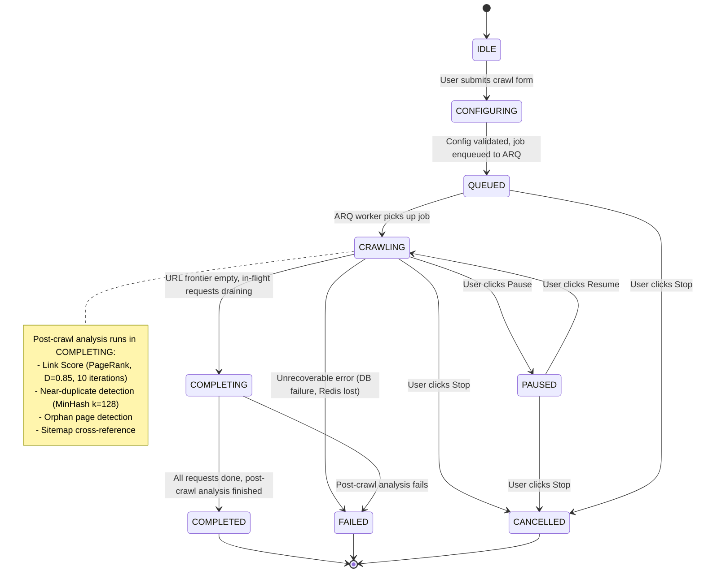
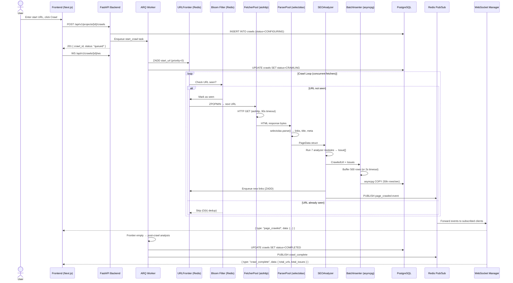
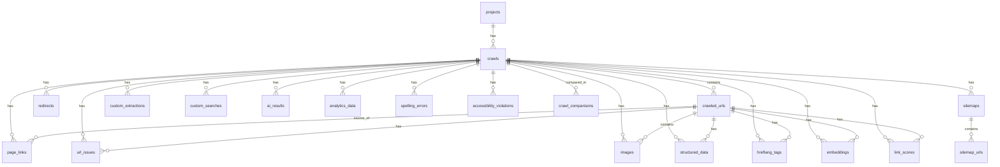

# 🕷️ SEO Spider — Screaming Frog Clone

## Comprehensive Implementation Plan

> **Tech Stack**: Next.js 15 (Frontend) + Python FastAPI (Backend) + PostgreSQL + Redis + Playwright
> **Deployment**: Self-hosted, runs locally via Docker Compose
> **License**: Open-source (personal use)
> **V1 Scope**: Single-user, self-hosted. Multi-user collaboration (Feature 6.5) is deferred to V2.

---

## 📋 Table of Contents

### Foundation
- [สรุป Feature ทั้งหมด](#สรุป-feature-ทั้งหมด)
- [Architecture Overview](#architecture-overview)
- [Project Structure](#project-structure) *(coming soon)*
- [Database Schema](#database-schema) *(coming soon)*
- [Crawler Engine Deep Dive](#crawler-engine--technical-deep-dive) *(coming soon)*
- [WebSocket Protocol](#websocket-protocol) *(coming soon)*

### API & Integration
- [API Specification](#api-specification) *(coming soon)*
- [Performance Strategy](#performance-strategy) *(coming soon)*
- [Error Handling Strategy](#error-handling-strategy) *(coming soon)*
- [Testing Strategy](#testing-strategy) *(coming soon)*
- [Docker Compose & Deployment](#docker-compose--deployment) *(coming soon)*

### Features
- [Phase 1: Core Crawl Engine](#phase-1-core-crawl-engine-)
- [Phase 2: SEO Analysis & Audit](#phase-2-seo-analysis--audit-)
- [Phase 3: Advanced Analysis](#phase-3-advanced-analysis-)
- [Phase 4: Integrations & AI](#phase-4-integrations--ai-)
- [Phase 5: Reports & Automation](#phase-5-reports--automation-)
- [Phase 6: Bonus Features](#phase-6-bonus-features-ของเพิ่ม-)

### Reference
- [Tech Stack Details](#tech-stack-details)
- [Development Timeline](#development-timeline-estimated)
- [Feature Dependency Graph](#feature-dependency-graph) *(coming soon)*
- [URL References](#url-references-ทุก-feature)

---

## สรุป Feature ทั้งหมด

จากการศึกษา Screaming Frog SEO Spider User Guide + Tutorials ทุกหน้า พบ **57 tabs** และ **300+ SEO issues** ทั้งหมด แบ่ง features ออกเป็น **6 Phases** ดังนี้:

| Phase | Focus | Features | Priority |
|-------|-------|----------|----------|
| **Phase 1** | Core Crawl Engine | 12 features | 🔴 Critical |
| **Phase 2** | SEO Analysis & Audit | 15 features | 🔴 Critical |
| **Phase 3** | Advanced Analysis | 10 features | 🟡 Important |
| **Phase 4** | Integrations & AI | 8 features | 🟡 Important |
| **Phase 5** | Reports & Automation | 7 features | 🟢 Nice-to-have |
| **Phase 6** | Bonus Features (ของเพิ่ม) | 6 features | 🟢 Enhancement |

---

## Architecture Overview

> **System Design**: 5-layer architecture — Nginx (entry) → Next.js 15 (frontend) → FastAPI (backend) → Crawler Engine → Data Layer (PostgreSQL + Redis)

### 2a. System Architecture Diagram

```
                    ┌───────────────────────────────────────┐
                    │          External Traffic              │
                    │        (Browser / API Client)          │
                    └──────────────────┬────────────────────┘
                                       │ :80
                    ┌──────────────────▼────────────────────┐
                    │          Nginx (Reverse Proxy)         │
                    │  /api/* → backend:8000                 │
                    │  /ws/*  → backend:8000 (WS upgrade)   │
                    │  /*     → frontend:3000                │
                    └──────────────────┬────────────────────┘
                                       │
          ┌────────────────────────────┼────────────────────────────┐
          │                            │                            │
┌─────────▼──────────┐    ┌───────────▼────────────┐    ┌─────────▼──────────┐
│  Frontend           │    │  Backend (FastAPI)       │    │  ARQ Worker         │
│  (Next.js 15)       │    │  Port 8000               │    │  (Crawl Engine)     │
│                     │◄──►│                          │    │                     │
│  - App Router       │ WS │  - API Routers (/v1/*)   │    │  - URLFrontier      │
│  - Server Components│    │  - Services              │    │  - FetcherPool      │
│  - TanStack Query   │    │  - Repositories          │    │  - ParserPool       │
│  - Zustand store    │    │  - WebSocket Manager     │◄──►│  - SEOAnalyzer      │
│  - shadcn/ui        │    │  - ARQ task dispatch     │    │  - BatchInserter    │
└─────────────────────┘    └───────────┬──────────────┘    └──────────┬─────────┘
                                       │                              │
                       ┌───────────────┼──────────────────────────────┤
                       │               │                              │
             ┌─────────▼─────┐  ┌──────▼────────┐  ┌───────────────▼────┐
             │  PostgreSQL    │  │     Redis      │  │  Playwright         │
             │  (Primary DB)  │  │  - URL Frontier│  │  (JS Rendering)     │
             │  - crawled_urls│  │  - Pub/Sub     │  │  - Chromium         │
             │  - page_links  │  │  - ARQ queues  │  │  - PerformanceAPI   │
             │  - url_issues  │  │  - Bloom filter│  │  - Screenshot       │
             │  - 20+ tables  │  │  - Rate limits │  └────────────────────┘
             │  HASH partition│  └───────────────┘
             └───────────────┘
```

### 2b. Crawler State Machine



**State Descriptions**:

| State | Description |
|-------|-------------|
| `IDLE` | No active crawl — waiting for user input |
| `CONFIGURING` | Validating config (URL, crawl mode, limits) |
| `QUEUED` | Job in ARQ queue — waiting for worker slot |
| `CRAWLING` | Actively fetching, parsing, and storing pages |
| `PAUSED` | User paused — frontier preserved in Redis, no new requests |
| `COMPLETING` | Frontier empty — draining in-flight, running post-crawl analysis |
| `COMPLETED` | All done — data available for exploration |
| `FAILED` | Unrecoverable error — partial data available |
| `CANCELLED` | User stopped — partial data available |

### 2c. Data Flow — URL Lifecycle



### 2d. Component Interaction Map

| Component | Technology | Input | Output | Characteristic |
|-----------|-----------|-------|--------|----------------|
| **URLFrontier** | Redis sorted sets (ZADD/ZPOPMIN) | URLs + priority score | Next URL to fetch | I/O-bound; O(log N) per op |
| **FetcherPool** | aiohttp TCPConnector (limit=100, per_host=5) | URL + headers | HTTP response bytes + headers | I/O-bound; async concurrency |
| **ParserPool** | selectolax (primary) + lxml (XPath) | HTML bytes | PageData struct | CPU-bound; can multiprocess |
| **SEOAnalyzer** | 7 pluggable Python analyzer modules | PageData | Issue[] + enriched CrawledUrl | CPU-bound; inline with parser |
| **BatchInserter** | asyncpg COPY protocol | CrawledUrl[], Issue[] | DB rows committed | I/O-bound; 50k rows/sec |
| **WebSocketManager** | FastAPI WebSocket + Redis Pub/Sub | Redis events | JSON messages to N clients | I/O-bound; fan-out pattern |
| **RedisManager** | redis-py async client | Commands (ZADD, PUBLISH) | Results | I/O-bound; pipeline batching |
| **DatabasePool** | asyncpg connection pool (min=5, max=20) | SQL queries | Result rows / row counts | I/O-bound; connection reuse |

---

## Project Structure

> **Pattern**: Monorepo with `frontend/` (Next.js 15 App Router) and `backend/` (FastAPI, Router→Service→Repository).

### Root Layout

```
seo-spider/
├── frontend/               # Next.js 15 App Router
├── backend/                # Python FastAPI + ARQ workers
├── nginx/                  # Nginx reverse proxy config
├── docker-compose.yml      # Production services
├── docker-compose.dev.yml  # Development overrides (hot reload)
├── .env.example            # Environment variable template
└── README.md
```

### Frontend Structure (`frontend/`)

```
frontend/
├── app/
│   ├── layout.tsx                      # Root layout (ThemeProvider, QueryClient, fonts)
│   ├── page.tsx                        # Landing → redirect to /crawls
│   ├── (dashboard)/
│   │   ├── layout.tsx                  # Dashboard shell (sidebar, topbar, WS provider)
│   │   ├── page.tsx                    # Dashboard: recent crawls, global SEO score
│   │   ├── crawls/
│   │   │   ├── page.tsx                # Crawl list with status badges
│   │   │   ├── new/page.tsx            # New crawl form (URL, mode, config)
│   │   │   └── [crawlId]/
│   │   │       ├── page.tsx            # Crawl detail — main data grid view
│   │   │       ├── loading.tsx         # Suspense skeleton
│   │   │       ├── error.tsx           # Error boundary
│   │   │       └── _components/        # Co-located client components
│   │   │           ├── UrlDataGrid.tsx          # TanStack Table + react-virtual (1M+ rows)
│   │   │           ├── FilterPanel.tsx          # Dynamic filters per tab
│   │   │           ├── CrawlProgress.tsx        # Real-time WebSocket progress bar
│   │   │           ├── TabPanel.tsx             # Top tabs: Internal, External, Titles, etc.
│   │   │           ├── DetailPanel.tsx          # Bottom panel: per-URL details
│   │   │           ├── RightSidebar.tsx         # Issues, site structure, segments
│   │   │           └── SerpPreview.tsx          # SERP snippet preview (Google/Bing)
│   │   ├── reports/
│   │   │   └── page.tsx                # Reports: crawl overview, SERP summary, etc.
│   │   ├── visualizations/
│   │   │   └── page.tsx                # D3.js force-directed + treemap visualizations
│   │   └── settings/
│   │       ├── page.tsx                # General settings
│   │       ├── profiles/page.tsx       # Saved crawl configuration profiles
│   │       └── integrations/page.tsx   # GA4, GSC, PageSpeed API keys
│   └── api/
│       └── stream/[crawlId]/route.ts   # SSE proxy (Next.js Route Handler → FastAPI)
├── components/
│   ├── ui/                             # shadcn/ui primitives (button, dialog, etc.)
│   ├── crawl/                          # Crawl-specific components (StatusBadge, etc.)
│   ├── charts/                         # Recharts wrappers (IssuesPieChart, etc.)
│   └── layout/                         # Shell, sidebar nav, topbar
├── hooks/
│   ├── use-crawl-websocket.ts          # WebSocket hook with exponential backoff reconnect
│   ├── use-crawl-data.ts               # TanStack Query hooks for crawl data
│   └── use-filters.ts                  # Filter state management (URL, status, etc.)
├── lib/
│   ├── api-client.ts                   # Typed fetch wrapper for FastAPI endpoints
│   ├── query-client.ts                 # TanStack Query global config (staleTime, retry)
│   └── utils.ts                        # cn(), formatNumber(), truncateUrl()
├── stores/
│   └── crawl-store.ts                  # Zustand: active tab, selected URL, filter state
├── types/
│   └── index.ts                        # Shared TypeScript types (CrawlUrl, Issue, etc.)
├── next.config.ts
└── package.json
```

### Backend Structure (`backend/`)

```
backend/
├── app/
│   ├── main.py                         # App factory, lifespan events, middleware setup
│   ├── api/
│   │   ├── deps.py                     # Shared FastAPI dependencies (DB session, Redis)
│   │   └── v1/
│   │       ├── router.py               # Aggregates all v1 routers
│   │       ├── crawls.py               # /crawls, /crawls/{id}/pause|resume|stop, WS
│   │       ├── urls.py                 # /crawls/{id}/urls, /urls/{id}/inlinks
│   │       ├── issues.py               # /crawls/{id}/issues, /issues/summary
│   │       ├── reports.py              # /crawls/{id}/reports/{type}
│   │       ├── projects.py             # /projects CRUD
│   │       ├── configs.py              # /configs CRUD
│   │       ├── extractors.py           # /crawls/{id}/extractors, /extractions
│   │       ├── integrations.py         # /integrations/ga, /gsc, /psi
│   │       └── export.py               # /crawls/{id}/export (CSV/XLSX)
│   ├── core/
│   │   ├── config.py                   # Pydantic Settings (DATABASE_URL, REDIS_URL, etc.)
│   │   ├── exceptions.py               # Custom exception handlers (404, 422, 500)
│   │   └── logging.py                  # structlog configuration
│   ├── crawler/
│   │   ├── engine.py                   # CrawlEngine (async coordinator)
│   │   ├── frontier.py                 # URLFrontier (Redis sorted sets + Bloom filter)
│   │   ├── fetcher.py                  # FetcherPool (aiohttp, rate limiting)
│   │   ├── parser.py                   # ParserPool (selectolax primary + lxml XPath)
│   │   ├── analyzer.py                 # SEOAnalyzer (delegates to analysis/ modules)
│   │   ├── renderer.py                 # Playwright JS rendering (optional)
│   │   └── robots.py                   # robots.txt parser + per-domain cache
│   ├── analysis/
│   │   ├── titles.py                   # TitleAnalyzer (missing, length, duplicates)
│   │   ├── meta.py                     # MetaDescriptionAnalyzer
│   │   ├── headings.py                 # HeadingAnalyzer (H1/H2 structure)
│   │   ├── links.py                    # LinkAnalyzer (broken, redirects, nofollow)
│   │   ├── canonicals.py               # CanonicalAnalyzer (missing, self-ref, mismatch)
│   │   ├── duplicates.py               # DuplicateContentAnalyzer (SimHash + MinHash)
│   │   ├── structured_data.py          # StructuredDataValidator (JSON-LD/Microdata/RDFa)
│   │   ├── accessibility.py            # AccessibilityAnalyzer (AXE via Playwright)
│   │   ├── security.py                 # SecurityAnalyzer (HTTPS, headers, mixed content)
│   │   └── link_score.py               # LinkScoreCalculator (PageRank D=0.85, 10 iters)
│   ├── models/                         # SQLAlchemy ORM models (map to DB tables)
│   │   ├── base.py
│   │   ├── project.py
│   │   ├── crawl.py
│   │   ├── url.py
│   │   └── issue.py
│   ├── schemas/                        # Pydantic request/response schemas
│   │   ├── crawl.py                    # CrawlCreate, CrawlResponse, CrawlSummary
│   │   ├── url.py                      # CrawledUrlResponse, UrlDetail
│   │   ├── issue.py                    # IssueResponse, IssueSummary
│   │   └── pagination.py               # CursorPage[T], PaginationParams
│   ├── repositories/                   # DB query layer (raw asyncpg / SQLAlchemy)
│   │   ├── base.py                     # Generic keyset-paginated CRUD base
│   │   ├── crawl_repo.py
│   │   ├── url_repo.py
│   │   └── issue_repo.py
│   ├── services/                       # Business logic layer
│   │   ├── crawl_service.py            # Orchestrates crawl lifecycle
│   │   ├── analysis_service.py         # Post-crawl analysis (link score, duplicates)
│   │   ├── report_service.py           # Report data aggregation
│   │   └── export_service.py           # CSV/XLSX/Sitemap generation
│   ├── db/
│   │   ├── session.py                  # asyncpg pool + SQLAlchemy async engine
│   │   ├── migrations/                 # Alembic migration files
│   │   └── init.sql                    # Extension setup (pgvector, pg_trgm, uuid-ossp)
│   ├── worker/
│   │   ├── settings.py                 # ARQ WorkerSettings (redis_settings, functions)
│   │   └── tasks/
│   │       ├── crawl_tasks.py          # start_crawl(), process_url_batch()
│   │       └── analysis_tasks.py       # run_post_crawl_analysis(), calc_link_scores()
│   └── websocket/
│       └── manager.py                  # WebSocketManager (Redis pub/sub fan-out)
├── tests/
│   ├── conftest.py                     # Fixtures: async_db, redis_client, http_client
│   ├── unit/                           # Unit tests (analyzers, parsers, algorithms)
│   ├── api/                            # API tests (httpx + pytest-asyncio)
│   ├── integration/                    # Integration tests (testcontainers PostgreSQL)
│   └── crawler/                        # Crawler tests (respx HTTP mocking)
├── Dockerfile
└── pyproject.toml
```

---

## Phase 1: Core Crawl Engine 🔴

> เป็นหัวใจหลักของโปรแกรม — ต้องทำก่อนทุก feature

### Feature 1.1: Spider Mode Crawling
**คำอธิบาย**: ป้อน URL แล้วโปรแกรม crawl ทุก link ที่พบบน subdomain เดียวกัน แบบ recursive (BFS)
**Reference**: https://www.screamingfrog.co.uk/seo-spider/user-guide/general/#crawling

**รายละเอียด**:
- ป้อน URL ใน input → กด Start → crawl ทุก internal link
- Default crawl เฉพาะ subdomain เดียว (เช่น `www.example.com`)
- รองรับ crawl จาก subfolder (เช่น `example.com/blog/`)
- Real-time progress bar แสดง URLs completed / remaining
- Pause / Resume / Stop controls
- รองรับ HTTPS + HTTP
- ดึง data จากทุกหน้า: status code, title, meta desc, h1, h2, word count, response time, page size

**Technical Implementation**:
- Python asyncio + aiohttp สำหรับ concurrent HTTP requests
- BFS queue ใน Redis (breadth-first discovery)
- HTML parsing ด้วย **selectolax** (primary, 35x faster) + **lxml** (XPath fallback สำหรับ Custom Extraction)
- URL normalization (lowercase, strip fragments, decode percent-encoding)
- URL deduplication ด้วย **Bloom filter** (ScalableBloomFilter, ~12MB per 1M URLs)
- Configurable threads (1-20) + rate limiting (requests/sec)
- Bulk DB inserts ด้วย **asyncpg COPY** (~50k rows/sec)
- Task queue ด้วย **ARQ** (async-native, ใช้ Redis ที่มีอยู่แล้ว — แทน Celery)
- WebSocket push updates ไป frontend ทุก 500ms

---

### Feature 1.2: List Mode
**คำอธิบาย**: Upload/Paste รายการ URLs → crawl เฉพาะ URLs เหล่านั้น (depth=0)
**Reference**: https://www.screamingfrog.co.uk/seo-spider/tutorials/how-to-use-list-mode/

**รายละเอียด**:
- Toggle ระหว่าง Spider Mode ↔ List Mode
- Upload จากไฟล์ (.txt, .csv) หรือ paste ลงใน textarea
- Download URLs จาก XML Sitemap (รองรับ sitemap index)
- Default crawl depth = 0 (เฉพาะ URLs ที่ upload)
- Export ยังคง original order ตอน upload (รวม duplicates)
- สามารถ enable crawl depth > 0 เพื่อ crawl outlinks ด้วย

---

### Feature 1.3: URL Discovery & Link Extraction
**คำอธิบาย**: Parse HTML เพื่อค้นหา links ทุกประเภท
**Reference**: https://www.screamingfrog.co.uk/seo-spider/user-guide/configuration/#internal-hyperlinks

**รายละเอียด**:
- Extract `<a href>` hyperlinks (internal + external)
- Extract `` images + `srcset` responsive images
- Extract `<link rel="stylesheet">` CSS
- Extract `<script src>` JavaScript
- Extract `<link rel="canonical">` canonicals
- Extract `<link rel="alternate" hreflang>` hreflang
- Extract `<link rel="amphtml">` AMP
- Extract `<meta http-equiv="refresh">` meta refresh redirects
- Extract `<iframe src>` iframes
- Extract `<link rel="next/prev">` pagination
- แต่ละ resource type มี toggle Store/Crawl แยกกัน
- ตัวเลือก: Follow nofollow links, Crawl outside start folder, Crawl all subdomains

---

### Feature 1.4: JavaScript Rendering
**คำอธิบาย**: Render pages ด้วย headless browser (Chromium) เพื่อ crawl JavaScript-heavy sites (React, Vue, Angular)
**Reference**: https://www.screamingfrog.co.uk/seo-spider/user-guide/configuration/#rendering
**Reference**: https://www.screamingfrog.co.uk/seo-spider/tutorials/crawl-javascript-seo/

**รายละเอียด**:
- 3 modes: Text Only (HTML), Old AJAX Scheme, JavaScript (Chromium)
- JavaScript mode ใช้ Playwright (headless Chromium)
- Compare raw HTML vs rendered HTML → detect JS-only content
- รองรับ screenshots ของ rendered page
- Configurable viewport size (Desktop/Mobile/Custom)
- AJAX timeout (default 5 sec — เวลารอ JS execute)
- Flatten Shadow DOM & iframes (เหมือน Googlebot)
- Capture JavaScript console errors

---

### Feature 1.5: HTTP Response Handling
**คำอธิบาย**: จัดการ HTTP responses ทุกประเภท — redirects, errors, timeouts
**Reference**: https://www.screamingfrog.co.uk/seo-spider/user-guide/tabs/#response-codes

**รายละเอียด**:
- Track status codes: 2XX, 3XX, 4XX, 5XX
- Follow redirect chains (301→302→200)
- Detect redirect loops
- Identify redirect types: HTTP, JavaScript, Meta Refresh
- Configurable max redirects to follow
- Configurable response timeout
- 5XX retry mechanism (configurable retry count)
- Track response time per URL

---

### Feature 1.6: Robots.txt Handling
**คำอธิบาย**: อ่านและเคารพ (หรือเพิกเฉย) robots.txt ของ website
**Reference**: https://www.screamingfrog.co.uk/seo-spider/user-guide/general/#robots-txt
**Reference**: https://www.screamingfrog.co.uk/seo-spider/tutorials/robots-txt-tester/

**รายละเอียด**:
- 3 modes: Respect / Ignore / Ignore but Report
- แสดง URLs ที่ถูก block พร้อม directive line ที่ match
- Custom robots.txt editor (test ก่อน deploy จริง)
- รองรับ robots.txt per subdomain
- ใช้ user-agent ที่เลือกในการ test

---

### Feature 1.7: User Agent Configuration
**คำอธิบาย**: เปลี่ยน user-agent string ที่ใช้ crawl
**Reference**: https://www.screamingfrog.co.uk/seo-spider/user-guide/configuration/#user-agent-2

**รายละเอียด**:
- Preset UAs: Googlebot Desktop, Googlebot Mobile, Bingbot, Chrome, Safari, Screaming Frog default
- Custom user-agent string
- ใช้ร่วมกับ robots.txt testing

---

### Feature 1.8: Crawl Limits & Speed Control
**คำอธิบาย**: จำกัดขอบเขตและความเร็วของการ crawl
**Reference**: https://www.screamingfrog.co.uk/seo-spider/user-guide/configuration/#limit-search-total-2
**Reference**: https://www.screamingfrog.co.uk/seo-spider/user-guide/configuration/#speed

**รายละเอียด**:
- Limit: Total URLs, Crawl Depth, URLs per Depth, Folder Depth
- Limit: Query Strings count, URL Length, Links per URL, Page Size
- Limit: Total per Subdomain, Max Redirects
- Limit by URL path pattern (เช่น `/blog/` max 500 URLs)
- Speed: Max concurrent threads (1-20)
- Speed: Max requests per second
- Speed: Pause between requests (ms)

---

### Feature 1.9: Include / Exclude URL Patterns
**คำอธิบาย**: กรอง URL ด้วย regex — Include (whitelist) หรือ Exclude (blacklist)
**Reference**: https://www.screamingfrog.co.uk/seo-spider/user-guide/configuration/#include
**Reference**: https://www.screamingfrog.co.uk/seo-spider/user-guide/configuration/#exclude

**รายละเอียด**:
- Include: เฉพาะ URLs ที่ match regex เท่านั้นที่จะ crawl
- Exclude: ข้าม URLs ที่ match regex
- Regex matching on encoded URL
- Multiple patterns support
- Test regex ก่อน crawl

---

### Feature 1.10: URL Rewriting
**คำอธิบาย**: Transform URLs ก่อนเพิ่มเข้า crawl queue (ลบ parameters, normalize)
**Reference**: https://www.screamingfrog.co.uk/seo-spider/user-guide/configuration/#url-rewriting

**รายละเอียด**:
- Remove specific query parameters (เช่น utm_source, sid)
- Remove all query strings
- Custom regex find/replace rules
- Lowercase all URLs option
- Percent encoding mode toggle
- Test URL rewriting ก่อน crawl

---

### Feature 1.11: CDN Configuration
**คำอธิบาย**: ตั้งค่า CDN domains ให้ถือเป็น Internal URLs
**Reference**: https://www.screamingfrog.co.uk/seo-spider/user-guide/configuration/#cdn

**รายละเอียด**:
- ใส่ CDN hostnames (เช่น cdn.example.com, static.example.com)
- CDN URLs จะปรากฏใน Internal tab พร้อม full data extraction
- รองรับ domain + subfolder

---

### Feature 1.12: Authentication
**คำอธิบาย**: Crawl เว็บที่ต้อง login หรือมี password protection
**Reference**: https://www.screamingfrog.co.uk/seo-spider/user-guide/configuration/#authentication
**Reference**: https://www.screamingfrog.co.uk/seo-spider/tutorials/crawling-password-protected-websites/

**รายละเอียด**:
- HTTP Basic / Digest Authentication
- Form-based login (URL, field names, credentials)
- Custom HTTP headers (Authorization, Cookie)
- Cookie-based session management

---

## Phase 2: SEO Analysis & Audit 🔴

> Core SEO analysis features — ข้อมูล SEO ที่ users ต้องการจริงๆ

### Feature 2.1: Page Titles Analysis
**คำอธิบาย**: วิเคราะห์ `<title>` tags — ความยาว, pixel width, duplicates, structural issues
**Reference**: https://www.screamingfrog.co.uk/seo-spider/user-guide/tabs/#page-titles

**Filters**: Missing, Duplicate, Over 60 chars, Below 30 chars, Over X pixels, Below X pixels, Same as H1, Multiple, Outside `<head>`

---

### Feature 2.2: Meta Descriptions Analysis
**คำอธิบาย**: วิเคราะห์ `<meta name="description">` — completeness, uniqueness, SERP display length
**Reference**: https://www.screamingfrog.co.uk/seo-spider/user-guide/tabs/#meta-description

**Filters**: Missing, Duplicate, Over 155 chars, Below 70 chars, Over/Below X pixels, Multiple

---

### Feature 2.3: Headings Analysis (H1, H2)
**คำอธิบาย**: วิเคราะห์ H1/H2 headings — presence, uniqueness, length, count
**Reference**: https://www.screamingfrog.co.uk/seo-spider/user-guide/tabs/#h1

**Filters**: Missing, Duplicate, Over 70 chars, Multiple, Non-Sequential

---

### Feature 2.4: Images Audit
**คำอธิบาย**: ตรวจสอบ images — alt text, file size, dimensions
**Reference**: https://www.screamingfrog.co.uk/seo-spider/user-guide/tabs/#images
**Reference**: https://www.screamingfrog.co.uk/seo-spider/tutorials/how-to-find-missing-image-alt-text/

**Filters**: Missing Alt Text, Missing Alt Text (Linked), Alt Text Over X chars, Over X kb, Missing Size Attributes, Incorrectly Sized, Non-Descriptive Alt Text

---

### Feature 2.5: Canonicals Audit
**คำอธิบาย**: ตรวจสอบ `<link rel="canonical">` — correctness, consistency
**Reference**: https://www.screamingfrog.co.uk/seo-spider/user-guide/tabs/#canonicals
**Reference**: https://www.screamingfrog.co.uk/seo-spider/tutorials/how-to-audit-canonicals/

**Filters**: Contains Canonical, Self-Referencing, Non-Indexable Canonical, Canonical Mismatch, Missing, Multiple, Canonicalised

---

### Feature 2.6: Directives Audit (Meta Robots / X-Robots-Tag)
**คำอธิบาย**: วิเคราะห์ crawler directives — noindex, nofollow, etc.
**Reference**: https://www.screamingfrog.co.uk/seo-spider/user-guide/tabs/#directives

**Filters**: Noindex, Nofollow, Noindex+Nofollow, Noarchive, Nosnippet, None, X-Robots-Tag, Multiple Meta Robots

---

### Feature 2.7: URL Quality Audit
**คำอธิบาย**: ตรวจสอบคุณภาพ URL — length, characters, parameters, structure
**Reference**: https://www.screamingfrog.co.uk/seo-spider/user-guide/tabs/#uri

**Filters**: Non ASCII, Underscores, Uppercase, Multiple Slashes, Repetitive Path, Contains Space, Internal Search, Parameters, Broken Bookmark, GA Tracking Parameters, Over 115 chars

---

### Feature 2.8: Security Audit
**คำอธิบาย**: ตรวจสอบ security issues — HTTPS, mixed content, headers
**Reference**: https://www.screamingfrog.co.uk/seo-spider/user-guide/tabs/#security

**Filters**: HTTP URLs, Mixed Content, Form URL Insecure, Unsafe Cross-Origin Links, Missing HSTS, Missing CSP, Missing X-Content-Type-Options, Missing X-Frame-Options, Missing Secure Referrer-Policy, Bad Content Type

---

### Feature 2.9: Broken Links Detection
**คำอธิบาย**: หา broken links (4XX errors) ทั้งหมด พร้อม source pages
**Reference**: https://www.screamingfrog.co.uk/seo-spider/tutorials/broken-link-checker/

**รายละเอียด**:
- Response Codes tab → Client Error (4XX) filter
- แสดง: broken URL, status code, source pages (inlinks), anchor text
- รองรับ broken bookmarks (fragment #anchor validation)
- Bulk Export: 4XX Inlinks (source→broken URL pairs)

---

### Feature 2.10: Internal Links Analysis
**คำอธิบาย**: วิเคราะห์ internal linking — crawl depth, link equity, anchor text
**Reference**: https://www.screamingfrog.co.uk/seo-spider/tutorials/internal-linking-audit-with-the-seo-spider/
**Reference**: https://www.screamingfrog.co.uk/seo-spider/user-guide/tabs/#links

**Filters**: High Crawl Depth, Orphan Pages, High Internal Outlinks, High External Outlinks, No Internal Outlinks, Non-Descriptive Anchor Text, Nofollow Internal/External, Sponsored, UGC

**Data**: Inlinks, Unique Inlinks, JS Inlinks, % of Total, Outlinks, Crawl Depth, Link Score

---

### Feature 2.11: Content Analysis
**คำอธิบาย**: วิเคราะห์เนื้อหา — word count, readability, text ratio
**Reference**: https://www.screamingfrog.co.uk/seo-spider/user-guide/tabs/#content

**รายละเอียด**:
- Word count (configurable content area — include/exclude HTML elements, classes, IDs)
- Flesch Reading Ease Score (0-100)
- Average words per sentence
- Text to Code ratio
- Content area config: default excludes `<nav>` and `<footer>`

---

### Feature 2.12: Duplicate Content Detection
**คำอธิบาย**: หา exact & near-duplicate content
**Reference**: https://www.screamingfrog.co.uk/seo-spider/tutorials/how-to-check-for-duplicate-content/

**รายละเอียด**:
- **Exact Duplicates**: MD5 hash comparison (real-time during crawl)
- **Near Duplicates**: MinHash algorithm (post-crawl analysis) + SimHash (real-time during crawl, 64-bit fingerprint)
- Configurable similarity threshold (default 90%)
- Side-by-side content diff highlighting
- Content area config to refine comparison scope

---

### Feature 2.13: Indexability Analysis
**คำอธิบาย**: กำหนด indexability status ของทุก URL
**Reference**: https://www.screamingfrog.co.uk/seo-spider/user-guide/configuration/#page-details

**รายละเอียด**:
- Indexable vs Non-Indexable classification
- Indexability Status reasons: Canonicalised, Noindex, Blocked by Robots.txt, Redirect, Client Error, etc.
- Used across all other features for filtering

---

### Feature 2.14: SERP Snippet Preview
**คำอธิบาย**: แสดง preview ว่า URL จะปรากฏใน Google SERPs อย่างไร
**Reference**: https://www.screamingfrog.co.uk/seo-spider/user-guide/tabs/#serp-snippet

**รายละเอียด**:
- Pixel-width based title/description truncation (ไม่ใช่ character count)
- Desktop / Mobile / Tablet switching
- Editable: แก้ title/description เพื่อ preview changes
- Export via Reports > SERP Summary

---

### Feature 2.15: Issues System
**คำอธิบาย**: ระบบตรวจหา SEO issues อัตโนมัติ 300+ ข้อ พร้อม priority
**Reference**: https://www.screamingfrog.co.uk/seo-spider/user-guide/tabs/#issues
**Reference**: https://www.screamingfrog.co.uk/seo-spider/issues/

**รายละเอียด**:
- Issue types: Issue / Warning / Opportunity
- Priority levels: High / Medium / Low
- Real-time update ระหว่าง crawl
- Click issue → navigate ไปยัง affected URLs
- Description + tips สำหรับทุก issue
- Bulk Export: All Issues as separate spreadsheets

---

## Phase 3: Advanced Analysis 🟡

### Feature 3.1: Structured Data Validation
**คำอธิบาย**: Extract & validate Schema.org structured data (JSON-LD, Microdata, RDFa)
**Reference**: https://www.screamingfrog.co.uk/seo-spider/tutorials/structured-data-testing-validation/
**Reference**: https://www.screamingfrog.co.uk/seo-spider/user-guide/tabs/#structured-data

**รายละเอียด**:
- รองรับ 3 formats: JSON-LD, Microdata, RDFa
- Schema.org vocabulary validation
- Google Rich Result feature validation (30+ types)
- Parse error detection
- Filters: Contains, Missing, Errors, Warnings, Parse Errors, by format

---

### Feature 3.2: Hreflang Audit
**คำอธิบาย**: ตรวจสอบ hreflang implementation สำหรับ multilingual/international sites
**Reference**: https://www.screamingfrog.co.uk/seo-spider/tutorials/how-to-audit-hreflang/
**Reference**: https://www.screamingfrog.co.uk/seo-spider/user-guide/tabs/#hreflang

**13 Filters**: Contains, Non-200 URLs, Unlinked URLs, Missing Return Links, Inconsistent Language & Region, Non-Canonical Return Links, Noindex Return Links, Incorrect Codes, Multiple Entries, Missing Self Reference, Not Using Canonical, Missing X-Default, Missing, Outside `<head>`

---

### Feature 3.3: XML Sitemap Audit
**คำอธิบาย**: Cross-reference crawl data กับ XML sitemaps
**Reference**: https://www.screamingfrog.co.uk/seo-spider/tutorials/how-to-audit-xml-sitemaps/
**Reference**: https://www.screamingfrog.co.uk/seo-spider/user-guide/tabs/#sitemaps

**Filters**: URLs In Sitemap, URLs Not In Sitemap, Orphan URLs, Non-Indexable in Sitemap, URLs In Multiple Sitemaps, Over 50k URLs, Over 50MB

---

### Feature 3.4: XML Sitemap Generator
**คำอธิบาย**: สร้าง XML Sitemap จาก crawl data
**Reference**: https://www.screamingfrog.co.uk/seo-spider/tutorials/xml-sitemap-generator/

**รายละเอียด**:
- Generate จาก crawl data (include only 200 OK, indexable pages)
- Configurable: lastmod, priority, changefreq
- Include images (optional)
- Include hreflang (optional)
- Auto-split sitemap ที่เกิน 50,000 URLs + sitemap index
- Generate Image Sitemap แยก

---

### Feature 3.5: Redirect Audit
**คำอธิบาย**: วิเคราะห์ redirect chains สำหรับ site migration
**Reference**: https://www.screamingfrog.co.uk/seo-spider/tutorials/audit-redirects/

**รายละเอียด**:
- List Mode + Always Follow Redirects
- Track complete redirect chain (ทุก hop)
- Detect: loops, temporary redirects in chain, broken chains
- All Redirects Report: chain type, hop count, final status, indexability
- Export: flat CSV with columns per hop

---

### Feature 3.6: Link Score (Internal PageRank)
**คำอธิบาย**: คำนวณ internal link equity score (PageRank-like, 0-100)
**Reference**: https://www.screamingfrog.co.uk/seo-spider/tutorials/link-score/

**Algorithm**:
- Damping coefficient D = 0.85
- 10 iterations to convergence
- Formula: `LS = ((1-D)/n) + (D × Σ(LS_source / outlinks_source))`
- Normalized to 1-100 logarithmic scale
- Nofollow links: don't pass score but count in outlink denominator
- Redirects/canonicals: bypass intermediate, flow to final target

---

### Feature 3.7: Orphan Pages Detection
**คำอธิบาย**: หา pages ที่ไม่มี internal link path จาก homepage
**Reference**: https://www.screamingfrog.co.uk/seo-spider/tutorials/find-orphan-pages/

**Data Sources**:
- XML Sitemaps (URLs in sitemap but not crawled internally)
- Google Analytics (pages with traffic but no internal links)
- Google Search Console (indexed pages with no internal links)
- Combined report: source per orphan URL

---

### Feature 3.8: Web Accessibility Audit
**คำอธิบาย**: ตรวจสอบ WCAG compliance ด้วย AXE engine
**Reference**: https://www.screamingfrog.co.uk/seo-spider/tutorials/how-to-perform-a-web-accessibility-audit/
**Reference**: https://www.screamingfrog.co.uk/seo-spider/user-guide/tabs/#accessibility

**รายละเอียด**:
- 92 AXE rules across WCAG 2.0/2.1/2.2 levels
- Filter groups: Best Practice (27), WCAG 2.0 A (56), 2.0 AA (3), 2.0 AAA (3), 2.1 AA (2), 2.2 AA (1)
- Per-URL violation count by WCAG level
- Violation details: issue, guideline, impact level, DOM location
- "Incomplete" checks for manual review
- Requires JS rendering mode (AXE runs in Chromium)

---

### Feature 3.9: Spelling & Grammar Check
**คำอธิบาย**: ตรวจ spelling/grammar errors ทั้ง site — 39 languages
**Reference**: https://www.screamingfrog.co.uk/seo-spider/tutorials/spelling-grammar-checker/

**รายละเอียด**:
- Auto-detect language via HTML `lang` attribute
- Check: page titles, meta descriptions, body content, PDFs
- Content area configurable (exclude nav, footer, comments)
- Error details: word, type, suggestion, page section
- Ignore/Dictionary management (per language)
- Re-run without re-crawling (uses stored HTML)
- Top 100 most common errors site-wide

**Technical**: ใช้ library เช่น LanguageTool API (open-source, self-hosted) — **LanguageTool runs as a separate Docker service** (port 8010) ใน docker-compose.yml

---

### Feature 3.10: Crawl Comparison
**คำอธิบาย**: Compare 2 crawls เพื่อ track changes over time
**Reference**: https://www.screamingfrog.co.uk/seo-spider/tutorials/how-to-compare-crawls/
**Reference**: https://www.screamingfrog.co.uk/seo-spider/user-guide/tabs/#change-detection

**รายละเอียด**:
- เลือก 2 crawls → Compare
- Change Detection: Added, New, Removed, Missing per filter
- Track changes: Title, Meta Description, H1, Word Count, Crawl Depth, Inlinks, Structured Data
- Content change detection via MinHash similarity %
- Side-by-side rendered page comparison
- Site Structure diff (directory tree + / - URLs)
- URL Mapping rules (regex) สำหรับ domain migration comparison

---

### Feature 3.11: PDF Audit
**คำอธิบาย**: ตรวจสอบ PDF files ที่พบระหว่าง crawl — ดึง metadata, links, และ content จาก PDFs
**Reference**: https://www.screamingfrog.co.uk/seo-spider/tutorials/how-to-audit-pdfs/

**รายละเอียด**:
- ตรวจจับ PDF files จาก Content-Type: application/pdf
- ดึง text content จาก PDFs (pdfplumber / PyMuPDF)
- ตรวจสอบ links ภายใน PDFs (internal + external)
- ตรวจสอบ PDF metadata: title, author, keywords, creation date
- ตรวจสอบ PDF file size (flag ถ้า > 5MB)
- แสดงผลใน "PDF" tab พร้อม filter: missing title, large file, broken links

**Technical Implementation**:
- Library: `pdfplumber` สำหรับ text extraction + `PyMuPDF (fitz)` สำหรับ metadata
- PDF links extracted และ added to crawl queue (ถ้า internal)
- PDF content stored ใน `crawled_urls.seo_data` JSONB field

---

### Feature 3.12: Cookie Audit
**คำอธิบาย**: ตรวจสอบ cookies ที่ถูก set โดยแต่ละ URL — ทั้ง first-party และ third-party
**Reference**: https://www.screamingfrog.co.uk/seo-spider/tutorials/how-to-perform-a-cookie-audit/

**รายละเอียด**:
- ตรวจจับ cookies จาก Set-Cookie response headers
- แยก first-party vs third-party cookies
- ตรวจสอบ security flags: Secure, HttpOnly, SameSite attribute
- GDPR compliance indicators: missing Secure flag, missing SameSite
- Cookie size และ count per URL
- แสดงผลใน "Cookies" tab พร้อม filter: missing Secure, missing HttpOnly, SameSite=None

**Technical Implementation**:
- Parse `Set-Cookie` headers ด้วย `http.cookiejar` หรือ `aiohttp` cookie handling
- Cookie data stored ใน `crawled_urls.seo_data` JSONB field
- Third-party detection: compare cookie domain vs page domain

---

### Feature 3.13: Pagination Audit
**คำอธิบาย**: ตรวจสอบ pagination implementation — rel="next"/rel="prev" tags และ pagination sequences
**Reference**: https://www.screamingfrog.co.uk/seo-spider/tutorials/how-to-audit-pagination/

**รายละเอียด**:
- ตรวจจับ `<link rel="next">` และ `<link rel="prev">` tags
- Validate pagination sequences: ไม่มี gaps, ไม่มี loops
- ตรวจจับ infinite scroll patterns (JS-loaded content)
- Cross-reference pagination URLs กับ canonical tags
- ตรวจสอบ: first page ไม่มี rel="prev", last page ไม่มี rel="next"
- แสดงผลใน "Pagination" tab พร้อม filter: broken sequence, missing rel tags

**Technical Implementation**:
- Extract `<link rel="next/prev">` ด้วย selectolax
- Build pagination graph: URL → next/prev URL
- Validate graph: detect cycles, gaps, orphaned pages
- Infinite scroll detection: check for JS-only content loading patterns

---

### Feature 3.14: Mobile Usability Check
**คำอธิบาย**: ตรวจสอบ mobile usability ของแต่ละ URL — viewport, touch targets, font sizes
**Reference**: Related to PSI integration + Lighthouse mobile audit

**รายละเอียด**:
- ตรวจจับ viewport meta tag: `<meta name="viewport" content="width=device-width">`
- Touch target size validation: ≥ 48×48 CSS pixels (Google recommendation)
- Font size validation: ≥ 12px (avoid tiny text)
- Content wider than viewport detection
- Responsive design indicators (CSS media queries presence)
- แสดงผลใน "Mobile" tab พร้อม filter: missing viewport, small touch targets, tiny fonts

**Technical Implementation**:
- Viewport tag: extracted ด้วย selectolax จาก `<meta name="viewport">`
- Touch target + font size: requires Playwright (headless browser) สำหรับ computed styles
- Fallback: static HTML analysis สำหรับ obvious issues (missing viewport tag)
- Results stored ใน `url_issues` table with type `mobile_usability`

---

### Feature 3.15: Core Web Vitals Measurement
**คำอธิบาย**: วัด Core Web Vitals (LCP, CLS, INP) โดยตรงจาก headless browser — ไม่ใช่แค่ PSI API data
**Reference**: https://www.screamingfrog.co.uk/seo-spider/tutorials/how-to-audit-core-web-vitals/

**รายละเอียด**:
- วัด LCP (Largest Contentful Paint), CLS (Cumulative Layout Shift), INP (Interaction to Next Paint)
- Lab data: วัดจาก Playwright + PerformanceObserver API
- Field data: ดึงจาก CrUX via PageSpeed Insights API (Feature 4.6)
- เปรียบเทียบ lab data vs field data per URL
- Filters: Poor CWV (red), Needs Improvement (orange), Good (green)
- แสดงผลใน "Core Web Vitals" tab พร้อม breakdown per metric

**Technical Implementation**:
- Playwright injects PerformanceObserver script ก่อน page load
- LCP: `new PerformanceObserver(...)` observe `largest-contentful-paint`
- CLS: `new PerformanceObserver(...)` observe `layout-shift`
- INP: `new PerformanceObserver(...)` observe `event` (interaction timing)
- Results stored ใน `crawled_urls.seo_data` JSONB: `{ "lcp_ms": 2400, "cls": 0.05, "inp_ms": 180 }`
- Thresholds: LCP good < 2.5s, CLS good < 0.1, INP good < 200ms

---

## Phase 4: Integrations & AI 🟡

### Feature 4.1: Custom Extraction (Web Scraping)
**คำอธิบาย**: Extract arbitrary data จาก HTML ด้วย XPath, CSS Selector, หรือ Regex
**Reference**: https://www.screamingfrog.co.uk/seo-spider/tutorials/web-scraping/
**Reference**: https://www.screamingfrog.co.uk/seo-spider/user-guide/configuration/#custom-extraction

**รายละเอียด**:
- สูงสุด 100 custom extractors
- Visual point-and-click extraction (built-in browser)
- 3 methods: XPath (1.0-3.1), CSS Selector, Regex
- **XPath queries ใช้ lxml backend**; CSS Selector queries ใช้ selectolax backend
- Extract: Element HTML, Inner HTML, Text, Function Value
- Results ปรากฏเป็น dynamic columns ใน Custom Extraction tab
- รองรับ rendered HTML (JS mode)

---

### Feature 4.2: Custom Search
**คำอธิบาย**: Search page source code ด้วย regex patterns
**Reference**: https://www.screamingfrog.co.uk/seo-spider/tutorials/how-to-use-custom-search/
**Reference**: https://www.screamingfrog.co.uk/seo-spider/user-guide/configuration/#custom-search

**รายละเอียด**:
- สูงสุด 100 custom search filters
- "Contains" / "Does Not Contain" per pattern
- Case sensitivity toggle
- Results ปรากฏเป็น dynamic filters ใน Custom Search tab
- ใช้หา: tracking codes, specific HTML patterns, phone numbers, disclaimers

---

### Feature 4.3: AI Integration (LLM Prompts)
**คำอธิบาย**: เชื่อมต่อ LLM APIs เพื่อ run AI prompts กับ crawl data ทุก URL
**Reference**: https://www.screamingfrog.co.uk/seo-spider/tutorials/how-to-crawl-with-ai-prompts/
**Reference**: https://www.screamingfrog.co.uk/seo-spider/user-guide/configuration/#openai

**รายละเอียด**:
- Providers: OpenAI, Gemini, Anthropic, Ollama (local)
- สูงสุด 100 AI prompts
- Content types: Page Text, HTML, Custom Extraction
- Use cases: generate meta descriptions, alt text, classify intent, detect sentiment
- Segment matching: run prompts เฉพาะ URLs ที่ match conditions
- Rate limiting per provider
- Test prompt ก่อน crawl
- Save/load prompt library (JSON)

---

### Feature 4.4: Vector Embeddings & Semantic Search
**คำอธิบาย**: สร้าง vector embeddings สำหรับ semantic similarity analysis
**Reference**: https://www.screamingfrog.co.uk/seo-spider/tutorials/how-to-identify-semantically-similar-pages-outliers/
**Reference**: https://www.screamingfrog.co.uk/seo-spider/tutorials/how-to-use-vector-embeddings-for-redirect-mapping/

**รายละเอียด**:
- Generate embeddings ด้วย OpenAI, Gemini, หรือ local models (Ollama)
- Semantic Search panel: ค้นหา pages ด้วย meaning (cosine similarity)
- Find semantically similar pages (for content consolidation)
- Detect off-topic/outlier pages
- Redirect mapping assistance (find closest content match)
- Centroid analysis: find "most representative page" + outliers

---

### Feature 4.5: Google Analytics Integration
**คำอธิบาย**: Import GA4 metrics ร่วมกับ crawl data
**Reference**: https://www.screamingfrog.co.uk/seo-spider/user-guide/configuration/#google-analytics-integration

**Metrics**: Sessions, New Users, Bounce Rate, Page Views/Session, Avg Session Duration, Goal Completions, etc.
**Filters**: Sessions > 0, Bounce Rate > 70%, No GA Data, Non-Indexable with GA Data, Orphan URLs

---

### Feature 4.6: Google Search Console Integration
**คำอธิบาย**: Import GSC Search Analytics + URL Inspection API data
**Reference**: https://www.screamingfrog.co.uk/seo-spider/user-guide/configuration/#google-search-console-integration

**Metrics**: Clicks, Impressions, CTR, Position
**URL Inspection**: Index status, crawl info, mobile usability, rich results
**Filters**: Clicks > 0, Not on Google, Indexable Not Indexed, User Canonical Not Selected

---

### Feature 4.7: PageSpeed Insights Integration
**คำอธิบาย**: Fetch CrUX field data + Lighthouse lab data per URL
**Reference**: https://www.screamingfrog.co.uk/seo-spider/tutorials/how-to-audit-core-web-vitals/
**Reference**: https://www.screamingfrog.co.uk/seo-spider/user-guide/configuration/#pagespeed-insights-integration

**Metrics**: LCP, INP, CLS, FCP, TTFB, Speed Index, TBT, Performance Score
**Opportunities**: 19 Lighthouse audit types (image delivery, render-blocking, unused CSS/JS, etc.)

---

### Feature 4.8: Link Metrics Integration (Ahrefs/Moz)
**คำอธิบาย**: Import backlink metrics จาก third-party APIs
**Reference**: https://www.screamingfrog.co.uk/seo-spider/user-guide/configuration/#ahrefs
**Reference**: https://www.screamingfrog.co.uk/seo-spider/user-guide/configuration/#moz

**Ahrefs**: Domain Rating, URL Rating, Referring Domains, Backlinks, Organic Traffic
**Moz**: Domain Authority, Page Authority, Spam Score, Linking Root Domains

---

## Phase 5: Reports & Automation 🟢

### Feature 5.1: Export System
**คำอธิบาย**: Export data หลายรูปแบบ — CSV, Excel, Google Sheets
**Reference**: https://www.screamingfrog.co.uk/seo-spider/user-guide/general/#exporting

**3 Export Methods**:
1. Tab/Filter Export (current view)
2. Lower Window Export (per-URL detail)
3. Bulk Export (cross-crawl data dumps)

**Bulk Export Categories**: Queued URLs, All Inlinks/Outlinks, Anchor Text, External Links, Screenshots, Page Source/Text, HTTP Headers, Cookies, by Response Code, by Content, by Images, by Canonicals, by Directives, Structured Data, Sitemaps, Issues, AI content

---

### Feature 5.2: Reports
**คำอธิบาย**: Pre-built aggregated reports
**Reference**: https://www.screamingfrog.co.uk/seo-spider/user-guide/general/#reports

**Reports**: SERP Summary, PageSpeed Opportunities, CSS/JS Coverage, HTTP Header Summary, Cookie Summary, Mobile Usability, Crawl Overview, Redirect Chains, Structured Data Validation Summary, Accessibility Violations Summary, Spelling & Grammar Summary, Orphan Pages

---

### Feature 5.3: Visualisations
**คำอธิบาย**: Interactive site architecture visualisations
**Reference**: https://www.screamingfrog.co.uk/seo-spider/tutorials/site-architecture-crawl-visualisations/
**Reference**: https://www.screamingfrog.co.uk/seo-spider/user-guide/general/#visualisations

**Types**:
1. Crawl Visualisations (by crawl depth / shortest path)
2. Directory Tree Visualisations (by URL structure)

**Formats**: 2D Force-Directed, 3D Force-Directed, Tree Graph

**Features**:
- Interactive: click, zoom, pan, focus/expand nodes
- Node color: green (indexable), red (non-indexable)
- Node scaling: by crawl depth, inlinks, Link Score, external metrics
- Export: HTML (interactive) or SVG (static)

**Technical**: ใช้ D3.js (2D), Three.js (3D) สำหรับ frontend visualisations

---

### Feature 5.4: Scheduling
**คำอธิบาย**: Schedule crawls แบบ one-off หรือ recurring
**Reference**: https://www.screamingfrog.co.uk/seo-spider/user-guide/general/#scheduling

**รายละเอียด**:
- ตั้งเวลา crawl: one-off / daily / weekly / monthly
- Headless mode (no UI)
- Auto-export after crawl: CSV, Excel, Google Sheets
- Email notifications on completion
- Crawl profiles (saved configurations)
- History log สำหรับ debug

---

### Feature 5.5: Configuration Profiles
**คำอธิบาย**: Save/Load crawl configurations
**Reference**: https://www.screamingfrog.co.uk/seo-spider/user-guide/general/#default-configuration

**รายละเอียด**:
- Save current config as named profile
- Load profile ก่อน crawl
- Set default profile
- Reset to factory defaults
- ใช้ profiles กับ scheduling + CLI

---

### Feature 5.6: Crawl Storage & Management
**คำอธิบาย**: Save, open, organize crawl data
**Reference**: https://www.screamingfrog.co.uk/seo-spider/user-guide/general/#saving-uploading-crawls

**รายละเอียด**:
- Database storage: auto-save, crash-safe, unlimited scale
- Project folders for organization
- Rename, duplicate, delete crawls in bulk
- Import/Export crawl files
- Crawl retention policies (auto-delete after N days)

---

### Feature 5.7: Segments
**คำอธิบาย**: Group URLs เป็น segments (เช่น Blog, Products, Landing Pages)
**Reference**: https://www.screamingfrog.co.uk/seo-spider/user-guide/configuration/#segments

**รายละเอียด**:
- Regex-based URL categorization
- Per-segment: URL count, Indexable, Issues, Warnings, Opportunities
- Filter all views by segment
- Segment-specific reports

---

## Phase 6: Bonus Features (ของเพิ่ม) 🟢

> Features ที่ไม่มีใน Screaming Frog แต่จะเป็นประโยชน์กับ users

### Feature 6.1: 📊 SEO Score Dashboard
**คำอธิบาย**: Dashboard overview ของ site health พร้อม overall SEO score (0-100)
- คำนวณจาก: broken links %, indexability %, page speed, security, structured data coverage
- Trend chart แสดง score changes over time (จาก crawl comparison)
- Color-coded health indicators per category
- Quick action items: top 5 issues to fix

---

### Feature 6.2: 🤖 AI-Powered Fix Suggestions
**คำอธิบาย**: ใช้ LLM สร้าง fix suggestions สำหรับทุก issue ที่พบ
- Generate suggested title tags, meta descriptions
- Suggest alt text for images (vision model)
- Recommend redirect mapping สำหรับ broken links
- Content improvement suggestions

---

### Feature 6.3: 📧 Automated Alerts & Monitoring
**คำอธิบาย**: Monitor site health อัตโนมัติ — แจ้งเตือนเมื่อพบปัญหาใหม่
- Schedule recurring crawls
- Compare กับ crawl ก่อนหน้า
- แจ้งเตือน: new broken links, title changes, new 5XX errors, indexability drops
- Channels: Email, Slack webhook, Discord webhook

---

### Feature 6.4: 📋 SEO Audit Report Generator
**คำอธิบาย**: สร้าง professional SEO audit report (PDF/HTML) อัตโนมัติ
- Executive summary + detailed findings
- Charts & visualisations
- Priority-ordered action items
- Customizable branding (logo, colors)
- Share via link

---

### Feature 6.5: 🔄 Real-time Collaboration
**คำอธิบาย**: Multi-user support สำหรับ team work

> ⚠️ **Deferred to V2** — V1 is single-user only. Multi-user collaboration requires authentication system not included in V1 scope.

- Share crawl results via link
- Comment/annotate on specific URLs
- Assign issues to team members
- Activity log

---

### Feature 6.6: 🧩 Plugin System
**คำอธิบาย**: Extensible plugin architecture สำหรับ custom analysis
- Python plugin API: register custom extractors, validators, reports
- Community plugin marketplace
- Example plugins: competitor analysis, content gap analysis, keyword clustering

---

## Database Schema

> **Design Principles**: HASH partitioning by `crawl_id` for hot tables; JSONB for flexible SEO metadata; TSVECTOR for full-text search; pgvector for embeddings; URL dedup via MD5 hash for O(1) lookups.

### Schema Overview

| Table | Rows (est.) | Partitioned | Purpose |
|-------|------------|-------------|---------|
| `projects` | < 100 | No | Site/project configurations |
| `crawls` | < 1,000 | No | Crawl sessions |
| `crawl_configs` | < 100 | No | Saved crawl configuration profiles |
| `crawled_urls` | Up to 1M | **HASH by crawl_id** | Main URL data + SEO signals |
| `page_links` | Up to 10M | No | Link graph edges |
| `url_issues` | Up to 5M | **HASH by crawl_id** | Detected SEO issues |
| `redirects` | Up to 100K | No | Redirect chain hops |
| `images` | Up to 500K | No | Image audit data |
| `structured_data` | Up to 200K | No | JSON-LD/Microdata/RDFa |
| `hreflang_tags` | Up to 100K | No | Hreflang annotations |
| `sitemaps` | Up to 1K | No | XML sitemap files |
| `sitemap_urls` | Up to 200K | No | URLs within sitemaps |
| `custom_extractions` | Up to 500K | No | Custom XPath/CSS/Regex results |
| `custom_searches` | Up to 500K | No | Custom pattern search results |
| `ai_results` | Up to 50K | No | AI prompt outputs |
| `embeddings` | Up to 100K | No | Vector embeddings (pgvector) |
| `analytics_data` | Up to 100K | No | GA4/GSC metrics |
| `spelling_errors` | Up to 200K | No | Spelling/grammar violations |
| `accessibility_violations` | Up to 500K | No | AXE engine results |
| `link_scores` | Up to 1M | No | PageRank-like link scores |
| `crawl_comparisons` | Up to 100 | No | Cross-crawl comparison metadata |

### Table Definitions

#### `projects`
```sql
CREATE TABLE projects (
    id          UUID PRIMARY KEY DEFAULT gen_random_uuid(),
    name        VARCHAR(255) NOT NULL,
    domain      VARCHAR(255) NOT NULL,
    settings    JSONB NOT NULL DEFAULT '{}',
    created_at  TIMESTAMPTZ NOT NULL DEFAULT NOW(),
    updated_at  TIMESTAMPTZ NOT NULL DEFAULT NOW()
);

CREATE INDEX idx_projects_domain ON projects (domain);
```

#### `crawls`
```sql
CREATE TABLE crawls (
    id              UUID PRIMARY KEY DEFAULT gen_random_uuid(),
    project_id      UUID NOT NULL REFERENCES projects(id) ON DELETE CASCADE,
    status          VARCHAR(20) NOT NULL DEFAULT 'idle'
                    CHECK (status IN ('idle','configuring','queued','crawling','paused','completing','completed','failed','cancelled')),
    mode            VARCHAR(10) NOT NULL DEFAULT 'spider'
                    CHECK (mode IN ('spider','list')),
    config          JSONB NOT NULL DEFAULT '{}',
    started_at      TIMESTAMPTZ,
    completed_at    TIMESTAMPTZ,
    total_urls      INTEGER NOT NULL DEFAULT 0,
    crawled_urls    INTEGER NOT NULL DEFAULT 0,
    error_count     INTEGER NOT NULL DEFAULT 0,
    created_at      TIMESTAMPTZ NOT NULL DEFAULT NOW()
);

CREATE INDEX idx_crawls_project_id ON crawls (project_id);
CREATE INDEX idx_crawls_status ON crawls (status) WHERE status IN ('crawling', 'paused', 'queued');
```

#### `crawl_configs`
```sql
CREATE TABLE crawl_configs (
    id          UUID PRIMARY KEY DEFAULT gen_random_uuid(),
    name        VARCHAR(255) NOT NULL,
    is_default  BOOLEAN NOT NULL DEFAULT false,
    config_data JSONB NOT NULL,
    created_at  TIMESTAMPTZ NOT NULL DEFAULT NOW()
);
```

#### `crawled_urls` (HASH partitioned by crawl_id)
```sql
CREATE TABLE crawled_urls (
    id                  BIGSERIAL,
    crawl_id            UUID NOT NULL REFERENCES crawls(id) ON DELETE CASCADE,
    url                 TEXT NOT NULL,
    url_hash            BYTEA NOT NULL,          -- MD5 of normalized URL
    status_code         SMALLINT,
    content_type        VARCHAR(100),
    redirect_url        TEXT,
    redirect_chain      JSONB DEFAULT '[]',       -- Array of {url, status_code}
    response_time_ms    INTEGER,
    title               TEXT,
    title_length        SMALLINT,
    title_pixel_width   SMALLINT,                -- Estimated pixel width at 13px
    meta_description    TEXT,
    meta_desc_length    SMALLINT,
    h1                  TEXT[],                   -- All H1 tags on page
    h2                  TEXT[],                   -- All H2 tags on page
    canonical_url       TEXT,
    robots_meta         TEXT[],                   -- noindex, nofollow, etc.
    is_indexable        BOOLEAN NOT NULL DEFAULT true,
    indexability_reason VARCHAR(100),             -- Reason if not indexable
    word_count          INTEGER,
    content_hash        BYTEA,                    -- SimHash for near-dup detection
    crawl_depth         SMALLINT NOT NULL DEFAULT 0,
    seo_data            JSONB NOT NULL DEFAULT '{}',  -- Flexible overflow data
    search_vector       TSVECTOR,                     -- Full-text search index
    crawled_at          TIMESTAMPTZ NOT NULL DEFAULT NOW(),
    PRIMARY KEY (id, crawl_id)
) PARTITION BY HASH (crawl_id);

-- Create 16 hash partitions
CREATE TABLE crawled_urls_0 PARTITION OF crawled_urls FOR VALUES WITH (MODULUS 16, REMAINDER 0);
CREATE TABLE crawled_urls_1 PARTITION OF crawled_urls FOR VALUES WITH (MODULUS 16, REMAINDER 1);
-- ... (16 partitions total)

CREATE INDEX idx_crawled_urls_crawl_hash    ON crawled_urls (crawl_id, url_hash);
CREATE INDEX idx_crawled_urls_status_code   ON crawled_urls (crawl_id, status_code);
CREATE INDEX idx_crawled_urls_search_vector ON crawled_urls USING GIN (search_vector);
CREATE INDEX idx_crawled_urls_seo_data      ON crawled_urls USING GIN (seo_data);
CREATE INDEX idx_crawled_urls_not_indexable ON crawled_urls (crawl_id) WHERE is_indexable = false;
CREATE INDEX idx_crawled_urls_errors        ON crawled_urls (crawl_id, status_code) WHERE status_code >= 400;
```

**Full-Text Search Trigger** (auto-updates `search_vector`):
```sql
CREATE OR REPLACE FUNCTION update_crawled_url_search_vector()
RETURNS TRIGGER AS $$
BEGIN
    NEW.search_vector :=
        setweight(to_tsvector('english', COALESCE(NEW.title, '')), 'A') ||
        setweight(to_tsvector('english', COALESCE(NEW.meta_description, '')), 'B') ||
        setweight(to_tsvector('english', COALESCE(NEW.url, '')), 'C');
    RETURN NEW;
END;
$$ LANGUAGE plpgsql;

CREATE TRIGGER trig_crawled_url_search_vector
BEFORE INSERT OR UPDATE OF title, meta_description, url
ON crawled_urls
FOR EACH ROW EXECUTE FUNCTION update_crawled_url_search_vector();
```

#### `page_links` (unpartitioned — used for cross-crawl link graph analysis)
```sql
CREATE TABLE page_links (
    id              BIGSERIAL PRIMARY KEY,
    crawl_id        UUID NOT NULL REFERENCES crawls(id) ON DELETE CASCADE,
    source_url_id   BIGINT NOT NULL,             -- FK to crawled_urls.id
    target_url      TEXT NOT NULL,
    target_url_hash BYTEA NOT NULL,
    anchor_text     TEXT,
    link_type       VARCHAR(20) NOT NULL DEFAULT 'internal'
                    CHECK (link_type IN ('internal','external','resource')),
    rel_attrs       TEXT[],                       -- nofollow, sponsored, ugc
    link_position   VARCHAR(20),                  -- header, nav, content, footer
    is_javascript   BOOLEAN NOT NULL DEFAULT false
);

CREATE INDEX idx_page_links_crawl_source  ON page_links (crawl_id, source_url_id);
CREATE INDEX idx_page_links_crawl_target  ON page_links (crawl_id, target_url_hash);
CREATE INDEX idx_page_links_nofollow      ON page_links (crawl_id) WHERE 'nofollow' = ANY(rel_attrs);
```

#### `url_issues` (HASH partitioned by crawl_id)
```sql
CREATE TABLE url_issues (
    id          BIGSERIAL,
    crawl_id    UUID NOT NULL REFERENCES crawls(id) ON DELETE CASCADE,
    url_id      BIGINT NOT NULL,                  -- FK to crawled_urls.id
    issue_type  VARCHAR(100) NOT NULL,            -- e.g. 'missing_title', 'redirect_chain'
    severity    VARCHAR(20) NOT NULL DEFAULT 'warning'
                CHECK (severity IN ('critical','warning','info','opportunity')),
    category    VARCHAR(50) NOT NULL,             -- e.g. 'titles', 'links', 'meta'
    details     JSONB NOT NULL DEFAULT '{}',
    PRIMARY KEY (id, crawl_id)
) PARTITION BY HASH (crawl_id);

CREATE INDEX idx_url_issues_crawl_type     ON url_issues (crawl_id, issue_type);
CREATE INDEX idx_url_issues_crawl_severity ON url_issues (crawl_id, severity);
CREATE INDEX idx_url_issues_url_id         ON url_issues (crawl_id, url_id);
```

#### `redirects`
```sql
CREATE TABLE redirects (
    id          BIGSERIAL PRIMARY KEY,
    crawl_id    UUID NOT NULL REFERENCES crawls(id) ON DELETE CASCADE,
    chain_id    UUID NOT NULL DEFAULT gen_random_uuid(),  -- Groups hops in one chain
    source_url  TEXT NOT NULL,
    target_url  TEXT NOT NULL,
    status_code SMALLINT NOT NULL,
    hop_number  SMALLINT NOT NULL DEFAULT 1
);

CREATE INDEX idx_redirects_crawl_chain ON redirects (crawl_id, chain_id);
CREATE INDEX idx_redirects_source_url  ON redirects (crawl_id, source_url);
```

#### `images`
```sql
CREATE TABLE images (
    id          BIGSERIAL PRIMARY KEY,
    crawl_id    UUID NOT NULL REFERENCES crawls(id) ON DELETE CASCADE,
    url_id      BIGINT NOT NULL,
    src         TEXT NOT NULL,
    alt_text    TEXT,
    title_attr  TEXT,
    width       INTEGER,
    height      INTEGER,
    file_size   INTEGER,
    is_linked   BOOLEAN NOT NULL DEFAULT false,
    issues      JSONB NOT NULL DEFAULT '[]'       -- Array of {type, severity}
);

CREATE INDEX idx_images_crawl_url    ON images (crawl_id, url_id);
CREATE INDEX idx_images_missing_alt  ON images (crawl_id) WHERE alt_text IS NULL OR alt_text = '';
```

#### `structured_data`
```sql
CREATE TABLE structured_data (
    id                 BIGSERIAL PRIMARY KEY,
    crawl_id           UUID NOT NULL REFERENCES crawls(id) ON DELETE CASCADE,
    url_id             BIGINT NOT NULL,
    format             VARCHAR(20) NOT NULL CHECK (format IN ('json-ld','microdata','rdfa')),
    schema_type        VARCHAR(100),              -- e.g. 'Product', 'BreadcrumbList'
    raw_data           JSONB NOT NULL,
    validation_errors  JSONB NOT NULL DEFAULT '[]'
);

CREATE INDEX idx_structured_data_crawl_url  ON structured_data (crawl_id, url_id);
CREATE INDEX idx_structured_data_schema_type ON structured_data (crawl_id, schema_type);
```

#### `hreflang_tags`
```sql
CREATE TABLE hreflang_tags (
    id                  BIGSERIAL PRIMARY KEY,
    crawl_id            UUID NOT NULL REFERENCES crawls(id) ON DELETE CASCADE,
    url_id              BIGINT NOT NULL,
    lang                VARCHAR(20) NOT NULL,     -- e.g. 'en', 'fr', 'zh-hans'
    region              VARCHAR(10),              -- e.g. 'US', 'GB'
    href                TEXT NOT NULL,
    return_link_status  VARCHAR(20)               -- 'ok', 'missing', 'mismatch', 'broken'
);

CREATE INDEX idx_hreflang_crawl_url ON hreflang_tags (crawl_id, url_id);
CREATE INDEX idx_hreflang_lang      ON hreflang_tags (crawl_id, lang);
```

#### `sitemaps`
```sql
CREATE TABLE sitemaps (
    id          UUID PRIMARY KEY DEFAULT gen_random_uuid(),
    crawl_id    UUID NOT NULL REFERENCES crawls(id) ON DELETE CASCADE,
    sitemap_url TEXT NOT NULL,
    url_count   INTEGER NOT NULL DEFAULT 0,
    is_index    BOOLEAN NOT NULL DEFAULT false,   -- Is sitemap index (vs regular)
    fetched_at  TIMESTAMPTZ NOT NULL DEFAULT NOW()
);
```

#### `sitemap_urls`
```sql
CREATE TABLE sitemap_urls (
    id          BIGSERIAL PRIMARY KEY,
    sitemap_id  UUID NOT NULL REFERENCES sitemaps(id) ON DELETE CASCADE,
    url         TEXT NOT NULL,
    lastmod     DATE,
    priority    NUMERIC(3,2),                    -- 0.0 to 1.0
    changefreq  VARCHAR(20)
);

CREATE INDEX idx_sitemap_urls_sitemap ON sitemap_urls (sitemap_id);
```

#### `custom_extractions`
```sql
CREATE TABLE custom_extractions (
    id              BIGSERIAL PRIMARY KEY,
    crawl_id        UUID NOT NULL REFERENCES crawls(id) ON DELETE CASCADE,
    url_id          BIGINT NOT NULL,
    extractor_name  VARCHAR(255) NOT NULL,
    value           TEXT,
    method          VARCHAR(10) NOT NULL CHECK (method IN ('xpath','css','regex'))
);

CREATE INDEX idx_custom_extractions_crawl_name ON custom_extractions (crawl_id, extractor_name);
```

#### `custom_searches`
```sql
CREATE TABLE custom_searches (
    id           BIGSERIAL PRIMARY KEY,
    crawl_id     UUID NOT NULL REFERENCES crawls(id) ON DELETE CASCADE,
    url_id       BIGINT NOT NULL,
    search_name  VARCHAR(255) NOT NULL,
    matched      BOOLEAN NOT NULL DEFAULT false,
    match_count  INTEGER NOT NULL DEFAULT 0
);

CREATE INDEX idx_custom_searches_crawl_name ON custom_searches (crawl_id, search_name);
```

#### `ai_results`
```sql
CREATE TABLE ai_results (
    id           BIGSERIAL PRIMARY KEY,
    crawl_id     UUID NOT NULL REFERENCES crawls(id) ON DELETE CASCADE,
    url_id       BIGINT NOT NULL,
    prompt_name  VARCHAR(255) NOT NULL,
    model        VARCHAR(100) NOT NULL,           -- e.g. 'gpt-4o', 'claude-3-5-sonnet'
    input_text   TEXT,
    output_text  TEXT,
    tokens_used  INTEGER,
    cost         NUMERIC(10,6),
    created_at   TIMESTAMPTZ NOT NULL DEFAULT NOW()
);

CREATE INDEX idx_ai_results_crawl_prompt ON ai_results (crawl_id, prompt_name);
```

#### `embeddings`
```sql
-- Requires pgvector extension: CREATE EXTENSION IF NOT EXISTS vector;
CREATE TABLE embeddings (
    id          BIGSERIAL PRIMARY KEY,
    crawl_id    UUID NOT NULL REFERENCES crawls(id) ON DELETE CASCADE,
    url_id      BIGINT NOT NULL,
    model       VARCHAR(100) NOT NULL,            -- e.g. 'text-embedding-3-small'
    vector      VECTOR(1536) NOT NULL,            -- OpenAI embedding dimensions
    created_at  TIMESTAMPTZ NOT NULL DEFAULT NOW()
);

CREATE INDEX idx_embeddings_crawl   ON embeddings (crawl_id);
CREATE INDEX idx_embeddings_vector  ON embeddings USING ivfflat (vector vector_cosine_ops)
    WITH (lists = 100);
```

#### `analytics_data`
```sql
CREATE TABLE analytics_data (
    id          BIGSERIAL PRIMARY KEY,
    crawl_id    UUID NOT NULL REFERENCES crawls(id) ON DELETE CASCADE,
    url_id      BIGINT NOT NULL,
    source      VARCHAR(10) NOT NULL CHECK (source IN ('ga4','gsc')),
    metrics     JSONB NOT NULL DEFAULT '{}'       -- GA4: sessions, pageviews; GSC: clicks, impressions, ctr, position
);

CREATE INDEX idx_analytics_crawl_source ON analytics_data (crawl_id, source);
```

#### `spelling_errors`
```sql
CREATE TABLE spelling_errors (
    id            BIGSERIAL PRIMARY KEY,
    crawl_id      UUID NOT NULL REFERENCES crawls(id) ON DELETE CASCADE,
    url_id        BIGINT NOT NULL,
    word          VARCHAR(255) NOT NULL,
    error_type    VARCHAR(50),                    -- 'spelling', 'grammar'
    suggestion    VARCHAR(255),
    page_section  VARCHAR(50),                    -- 'title', 'meta', 'body'
    language      VARCHAR(20) NOT NULL DEFAULT 'en'
);

CREATE INDEX idx_spelling_crawl_url ON spelling_errors (crawl_id, url_id);
```

#### `accessibility_violations`
```sql
CREATE TABLE accessibility_violations (
    id           BIGSERIAL PRIMARY KEY,
    crawl_id     UUID NOT NULL REFERENCES crawls(id) ON DELETE CASCADE,
    url_id       BIGINT NOT NULL,
    rule_id      VARCHAR(100) NOT NULL,           -- AXE rule ID, e.g. 'color-contrast'
    impact       VARCHAR(20) NOT NULL CHECK (impact IN ('critical','serious','moderate','minor')),
    wcag_level   VARCHAR(10),                     -- 'A', 'AA', 'AAA'
    wcag_sc      VARCHAR(20),                     -- e.g. '1.4.3'
    description  TEXT,
    dom_selector TEXT
);

CREATE INDEX idx_accessibility_crawl_url    ON accessibility_violations (crawl_id, url_id);
CREATE INDEX idx_accessibility_crawl_impact ON accessibility_violations (crawl_id, impact);
```

#### `link_scores`
```sql
CREATE TABLE link_scores (
    id              BIGSERIAL PRIMARY KEY,
    crawl_id        UUID NOT NULL REFERENCES crawls(id) ON DELETE CASCADE,
    url_id          BIGINT NOT NULL,
    score           NUMERIC(8,4) NOT NULL,        -- PageRank-like score (log scale 1-100)
    iteration_count SMALLINT NOT NULL DEFAULT 10
);

CREATE UNIQUE INDEX idx_link_scores_crawl_url ON link_scores (crawl_id, url_id);
```

#### `crawl_comparisons`
```sql
CREATE TABLE crawl_comparisons (
    id          UUID PRIMARY KEY DEFAULT gen_random_uuid(),
    crawl_id_a  UUID NOT NULL REFERENCES crawls(id) ON DELETE CASCADE,
    crawl_id_b  UUID NOT NULL REFERENCES crawls(id) ON DELETE CASCADE,
    created_at  TIMESTAMPTZ NOT NULL DEFAULT NOW(),
    summary     JSONB NOT NULL DEFAULT '{}'       -- {new_urls, removed_urls, changed_urls, new_issues}
);
```

### ER Diagram (Key Relationships)



---

## Crawler Engine — Technical Deep Dive

### 5a. URL Frontier Architecture

The URL Frontier manages crawl ordering and deduplication using a two-level queue design:

**Front Queues (Priority Tiers)**:
- Priority 0 (High): Start URL, sitemap URLs, manually added URLs
- Priority 1 (Normal): Internal links discovered during crawl
- Priority 2 (Low): External links, nofollow links (if configured)
- Implementation: Redis Sorted Sets (`ZADD crawl:{id}:frontier:p{tier} score url`)
- Dequeue: `ZPOPMIN` — O(log N) per operation

**Back Queues (Per-Domain FIFO)**:
- One queue per domain: `crawl:{id}:domain:{hash}` (Redis List)
- Enforces per-domain rate limiting (minimum 1s between requests)
- Domain scheduler: Redis Sorted Set `crawl:{id}:domain_ready` with next-available timestamp
- Fetcher picks domain with lowest next-available time

**URL Deduplication — Bloom Filter**:
- Library: `pybloom-live` ScalableBloomFilter
- Parameters: `initial_capacity=100_000, error_rate=0.001`
- Memory: ~12MB per 1M URLs (vs ~40MB for Python set)
- False positive rate: 0.1% (acceptable — worst case: skip a URL that wasn't crawled)
- Persistence: serialized to Redis blob every 1,000 URLs for crash recovery
- Fallback: exact check against `crawled_urls.url_hash` in PostgreSQL

**URL Normalization Algorithm**:
1. Lowercase scheme and host
2. Decode percent-encoding (except reserved chars)
3. Remove fragment (`#anchor`)
4. Normalize trailing slash (configurable: add or remove)
5. Handle IDN/punycode domains
6. Reject: `data:`, `javascript:`, `mailto:`, `tel:` URIs
7. Resolve relative URLs against base URL

---

### 5b. Fetcher Pool Design

**aiohttp TCPConnector Configuration**:
```
limit=100          # Total concurrent connections
limit_per_host=5   # Per-domain concurrency cap
ttl_dns_cache=300  # DNS cache TTL (seconds)
keepalive_timeout=30
enable_cleanup_closed=True
```

**Timeout Strategy**:
```
total=30s      # Total request timeout
connect=10s    # TCP connection timeout
sock_read=20s  # Socket read timeout
```

**Per-Domain Rate Limiter**:
- Respect `robots.txt` `Crawl-delay` directive
- Minimum 1 second between requests to same domain (configurable)
- Domain-level token bucket: refill rate = 1/crawl_delay tokens/sec

**Redirect Handling**:
- Manual redirect following (aiohttp `allow_redirects=False`)
- Track each hop: store in `redirect_chains` table
- Detect redirect loops: abort if URL seen in current chain
- Maximum 10 hops before marking as "redirect loop"

**Retry with Exponential Backoff**:
- Formula: `delay = min(2^attempt, 60)` seconds
- Maximum 3 retries per URL
- Retry on: connection errors, timeouts, 5XX responses
- No retry on: 4XX responses (except 429)
- Dead letter: URLs failing all retries → `crawl_errors` table

**Anti-Bot Handling**:
- HTTP 429 (Too Many Requests): domain-specific backoff (30s → 60s → 120s)
- Cloudflare challenges (403 + CF headers): skip URL, log as "blocked"
- CAPTCHAs: skip URL, report in issues as "bot protection detected"
- Configurable User-Agent string (default: custom bot UA with contact info)

---

### 5c. Parser Pipeline

**Dual-Parser Architecture**:

| Parser | Library | Use Case | Speed |
|--------|---------|----------|-------|
| Primary | selectolax (HTMLParser) | All standard extraction | 35x faster than BS4 |
| Secondary | lxml | XPath queries (Feature 4.1 Custom Extraction) | Slower, full XPath 1.0-3.1 |

**Extraction Order** (selectolax primary):
1. `<title>` — page title
2. `<meta name="description">` — meta description
3. `<meta name="robots">` — robots directives
4. `<link rel="canonical">` — canonical URL
5. `<h1>`, `<h2>`, `<h3>` — heading hierarchy
6. `<a href>` — all links (internal + external)
7. ``, `` — images with alt text
8. `<link rel="alternate" hreflang>` — hreflang tags
9. `<script type="application/ld+json">` — structured data
10. `<meta property="og:*">` — Open Graph tags

**Content Cleanup** (before word count):
- Decompose: `<script>`, `<style>`, `<noscript>`, `<template>`
- Strip HTML tags → plain text
- Normalize whitespace

**Content Hashing**:
- Exact duplicate: MD5 of normalized HTML content → stored in `crawled_urls.content_hash`
- Near-duplicate: SimHash of text content (64-bit fingerprint) → stored in `crawled_urls.simhash`
- Near-duplicate comparison: Hamming distance ≤ 3 bits = near-duplicate

---

### 5d. SEO Analyzer Pipeline

Pluggable architecture — each analyzer is an independent module returning `Issue[]` objects:

```
Issue = { type: str, severity: "error"|"warning"|"info", details: dict }
```

Analyzers run **inline during crawl** (streaming, not batch after):

| Analyzer | Checks |
|----------|--------|
| **TitleAnalyzer** | Missing title, too long (>60 chars / >580px), too short (<30 chars), duplicate, same as H1, multiple `<title>` tags, title outside `<head>` |
| **MetaDescriptionAnalyzer** | Missing, too long (>155 chars / >920px), too short (<70 chars), duplicate, multiple meta descriptions |
| **HeadingAnalyzer** | Missing H1, multiple H1 tags, H1 same as title, non-sequential heading levels (e.g., H1→H3 skipping H2) |
| **LinkAnalyzer** | Broken links (4XX/5XX), redirect chains (3+ hops), nofollow on internal links, orphan detection (post-crawl) |
| **CanonicalAnalyzer** | Missing canonical, self-referencing canonical, canonical pointing to non-indexable URL, canonical mismatch, multiple canonicals |
| **SecurityAnalyzer** | HTTP URLs (not HTTPS), mixed content (HTTPS page with HTTP resources), missing HSTS header, missing CSP header, missing X-Frame-Options |
| **ImageAnalyzer** | Missing alt text, alt text too long (>100 chars), oversized images (>200KB), missing width/height dimensions |

**Issue Severity Levels**:
- `error`: Directly impacts indexability or ranking (missing title, broken canonical)
- `warning`: Best practice violation (too long title, missing alt)
- `info`: Informational (self-referencing canonical, nofollow external)

---

### 5e. Batch Inserter

**asyncpg COPY Protocol** for high-throughput inserts:
- Throughput: ~50,000 rows/second (vs ~5,000 with individual INSERTs)
- Uses PostgreSQL binary COPY format via `asyncpg.connection.copy_records_to_table()`

**Buffer Strategy**:
- Accumulate rows in memory buffer
- Flush trigger: 500 rows accumulated OR 2 seconds elapsed (whichever first)
- Flush on: crawl pause, crawl stop, crawl complete

**Error Handling**:
- If batch COPY fails: retry individual rows via INSERT to isolate bad data
- Bad rows: logged to `crawl_errors` table with raw data for debugging
- Partial success: good rows committed, bad rows isolated

**Tables Written**:
- `crawled_urls` — one row per crawled URL
- `url_issues` — one row per issue found
- `page_links` — one row per link discovered
- `page_images` — one row per image found
- `structured_data` — one row per JSON-LD block

---

### 5f. Post-Crawl Analysis

Runs after crawl reaches COMPLETING state (all URLs fetched):

**Link Score (PageRank)**:
- Algorithm: PageRank with damping factor D=0.85
- Iterations: 10 (sufficient for convergence on typical site graphs)
- Formula: `PR(u) = (1-D)/N + D * Σ(PR(v)/OutLinks(v))`
- Input: `page_links` table (source_url_id → target_url_id)
- Output: stored in `crawled_urls.link_score`

**Near-Duplicate Detection (MinHash)**:
- Parameters: k=128 hash functions, bands=8, rows=16
- Similarity threshold: 90% (Jaccard similarity)
- Input: text content of all crawled pages
- Output: duplicate pairs stored in `duplicate_content` table
- Complements SimHash (used during crawl for quick near-dup flagging)

**Orphan Page Detection**:
- Definition: URL present in sitemap or GA/GSC import but NOT found in crawl link graph
- Process: LEFT JOIN sitemap_urls against page_links targets
- Output: stored in `url_issues` with type `orphan_page`

**Sitemap Cross-Reference**:
- Match crawled URLs against uploaded XML sitemaps
- Detect: URLs in sitemap but not crawled, URLs crawled but not in sitemap
- Output: `sitemap_coverage` percentage in crawl summary

---

## WebSocket Protocol

### 6a. Architecture

```
Crawler Workers → Redis Pub/Sub (channel: crawl:{id}:events) → FastAPI WebSocketManager → Client
```

**Why Redis Pub/Sub in the middle**:
- Decouples crawler workers (separate ARQ processes) from WebSocket connections
- Multiple FastAPI instances can subscribe to the same Redis channel (horizontal scaling)
- Crawler workers don't need to know about connected clients

**WebSocketManager** (FastAPI singleton):
- Subscribes to Redis channel `crawl:{id}:events` when first client connects
- Unsubscribes when last client disconnects
- Maintains per-client bounded asyncio.Queue (maxsize=100) for backpressure
- Runs as background asyncio task: Redis subscriber → fan-out to client queues

### 6b. Connection Protocol

**Endpoint**: `ws://localhost:8000/api/v1/crawls/{crawlId}/ws`

**Handshake**:
1. Client opens WebSocket connection
2. Server sends current crawl state immediately (snapshot)
3. Server begins streaming events

**Heartbeat**:
- Server sends `{"type": "ping"}` every 30 seconds
- Client must respond with `{"type": "pong"}` within 60 seconds
- No pong received in 60s → server closes connection with code 1001

**Client Reconnection Strategy**:
- Trigger: `WebSocket.onclose` event (not `onerror`)
- Backoff: 1s → 2s → 4s → 8s → 16s → 30s (max)
- Reset: backoff resets to 1s on successful connection
- On reconnect: server sends current state snapshot again

### 6c. Message Types

**Server → Client Messages**:

```json
// Progress update (throttled: max 1 per 500ms)
{ "type": "progress", "data": { "crawled": 1250, "queued": 3750, "errors": 12, "rate": 23.5, "elapsed_ms": 54000 } }

// Individual page crawled
{ "type": "page_crawled", "data": { "url": "https://example.com/page", "status_code": 200, "title": "Page Title", "issues_count": 3, "response_time_ms": 245 } }

// Issue discovered
{ "type": "issue_found", "data": { "url": "https://example.com/page", "issue_type": "missing_title", "severity": "error" } }

// Crawl state change
{ "type": "state_change", "data": { "from": "crawling", "to": "paused", "timestamp": "2024-01-01T12:00:00Z" } }

// Crawl completed
{ "type": "crawl_complete", "data": { "total_urls": 5000, "total_issues": 142, "duration_ms": 240000, "crawl_id": "uuid" } }

// Error on specific URL
{ "type": "error", "data": { "message": "Connection refused", "url": "https://example.com/broken", "attempt": 3 } }

// Heartbeat
{ "type": "ping" }
```

**Client → Server Messages**:

```json
// Heartbeat response
{ "type": "pong" }

// Crawl control commands
{ "type": "command", "action": "pause" }
{ "type": "command", "action": "resume" }
{ "type": "command", "action": "stop" }
```

### 6d. Backpressure Strategy

**Server-Side (per client)**:
- Bounded `asyncio.Queue(maxsize=100)` per connected client implements backpressure
- If queue is full: drop oldest event, enqueue newest (sliding window) — prevents memory bloat
- Progress events throttled at source: max 1 per 500ms (aggregated in Redis before publish)
- Backpressure mechanism: slow clients don't block fast crawler workers

**Client-Side (React)**:
- Keep last 500 events in React state (ring buffer — oldest dropped when full)
- Virtual scrolling for event log display (only render visible rows)
- Debounce UI updates: batch React state updates every 100ms

### 6e. Frontend Hook Pattern

```typescript
// Hook signature (pseudocode — not implementation)
useCrawlWebSocket(crawlId: string) → {
  events: CrawlEvent[],
  isConnected: boolean,
  lastProgress: ProgressData | null,
  sendCommand: (action: 'pause' | 'resume' | 'stop') => void
}
```

**Implementation Notes**:
- `useRef` for WebSocket instance (not state — avoids re-renders on reconnect)
- `useState` for events array (ring buffer, max 500 items)
- Cleanup on unmount: `ws.close()` in `useEffect` return function
- Reconnection logic in `ws.onclose` handler (not `ws.onerror`)
- Command sending: `ws.send(JSON.stringify({ type: 'command', action }))` with connection check

---

## API Specification

### 7a. Design Principles

- **Base URL**: `/api/v1/`
- **Pagination**: Keyset/cursor-based (NOT OFFSET) — O(1) at any depth
- **Filtering**: Query parameters per field (e.g., `?status_code=404&is_indexable=false`)
- **Sorting**: `?sort_by=response_time_ms&sort_dir=desc`
- **Error responses**: `{ "detail": "string", "code": "string", "status": 404 }`
- **Rate limiting**: None for V1 (single-user, local deployment)
- **Content-Type**: `application/json` for all endpoints

### 7b. Pagination Schema

Used across all list endpoints:

```json
// Request: GET /api/v1/crawls/{id}/urls?cursor=eyJpZCI6MTIzfQ&limit=100&sort_by=id&sort_dir=asc
// Response:
{
  "items": [...],
  "next_cursor": "eyJpZCI6MjIzfQ",
  "prev_cursor": "eyJpZCI6MTIzfQ",
  "total": 5000
}
```

Cursor is base64-encoded JSON: `{"id": 123}` or `{"response_time_ms": 245, "id": 123}` for multi-column sort.

### 7c. Error Response Schema

```json
{
  "detail": "Crawl not found",
  "code": "CRAWL_NOT_FOUND",
  "status": 404
}
```

Standard error codes: `CRAWL_NOT_FOUND`, `PROJECT_NOT_FOUND`, `CRAWL_ALREADY_RUNNING`, `INVALID_CURSOR`, `VALIDATION_ERROR`

### 7d. Endpoint Reference

#### Projects (5 endpoints)

| Method | Path | Description | DB Table |
|--------|------|-------------|----------|
| `POST` | `/api/v1/projects` | Create project | `projects` |
| `GET` | `/api/v1/projects` | List projects (cursor pagination) | `projects` |
| `GET` | `/api/v1/projects/{id}` | Get project detail | `projects` |
| `PUT` | `/api/v1/projects/{id}` | Update project name/domain | `projects` |
| `DELETE` | `/api/v1/projects/{id}` | Delete project + all crawls | `projects`, `crawls` |

**POST /api/v1/projects** — Request/Response:
```json
// Request
{ "name": "My Site", "domain": "https://example.com" }
// Response 201
{ "id": "uuid", "name": "My Site", "domain": "https://example.com", "created_at": "2024-01-01T00:00:00Z" }
```

#### Crawls (9 endpoints)

| Method | Path | Description | DB Table |
|--------|------|-------------|----------|
| `POST` | `/api/v1/projects/{id}/crawls` | Start new crawl | `crawls` |
| `GET` | `/api/v1/projects/{id}/crawls` | List crawls for project | `crawls` |
| `GET` | `/api/v1/crawls/{id}` | Get crawl detail + progress | `crawls` |
| `POST` | `/api/v1/crawls/{id}/pause` | Pause running crawl | `crawls` |
| `POST` | `/api/v1/crawls/{id}/resume` | Resume paused crawl | `crawls` |
| `POST` | `/api/v1/crawls/{id}/stop` | Stop crawl | `crawls` |
| `DELETE` | `/api/v1/crawls/{id}` | Delete crawl + all data | `crawls`, `crawled_urls` |
| `GET` | `/api/v1/crawls/{id}/summary` | Dashboard aggregates | `crawled_urls`, `url_issues` |
| `WS` | `/api/v1/crawls/{id}/ws` | Real-time WebSocket stream | — (see WebSocket Protocol) |

**POST /api/v1/projects/{id}/crawls** — Request/Response:
```json
// Request
{
  "start_url": "https://example.com",
  "mode": "spider",
  "config": {
    "max_urls": 10000,
    "max_depth": 10,
    "threads": 5,
    "respect_robots_txt": true,
    "crawl_delay_ms": 1000,
    "render_js": false
  }
}
// Response 201
{ "id": "uuid", "status": "queued", "project_id": "uuid", "start_url": "https://example.com", "created_at": "..." }
```

**GET /api/v1/crawls/{id}/summary** — Response:
```json
{
  "total_urls": 5000,
  "status_distribution": { "2xx": 4800, "3xx": 120, "4xx": 70, "5xx": 10 },
  "issue_counts": { "error": 45, "warning": 230, "info": 89 },
  "top_issues": [
    { "type": "missing_title", "count": 23, "severity": "error" },
    { "type": "title_too_long", "count": 45, "severity": "warning" }
  ],
  "crawl_coverage": { "crawled": 5000, "in_sitemap": 4800, "sitemap_coverage_pct": 96.0 }
}
```

#### URLs (4 endpoints)

| Method | Path | Description | DB Table |
|--------|------|-------------|----------|
| `GET` | `/api/v1/crawls/{id}/urls` | List crawled URLs (cursor, filters, sort) | `crawled_urls` |
| `GET` | `/api/v1/crawls/{id}/urls/{urlId}` | Get URL detail (all SEO data) | `crawled_urls`, `url_issues` |
| `GET` | `/api/v1/crawls/{id}/urls/{urlId}/inlinks` | Inbound links to this URL | `page_links` |
| `GET` | `/api/v1/crawls/{id}/urls/{urlId}/outlinks` | Outbound links from this URL | `page_links` |

**GET /api/v1/crawls/{id}/urls** — Query params: `?cursor=...&limit=100&status_code=404&is_indexable=false&sort_by=response_time_ms&sort_dir=desc`

**GET /api/v1/crawls/{id}/urls/{urlId}** — Response includes expanded `seo_data` JSONB:
```json
{
  "id": "uuid",
  "url": "https://example.com/page",
  "status_code": 200,
  "title": "Page Title",
  "meta_description": "...",
  "h1": "Main Heading",
  "word_count": 450,
  "response_time_ms": 245,
  "is_indexable": true,
  "canonical_url": "https://example.com/page",
  "seo_data": {
    "h2_tags": ["Section 1", "Section 2"],
    "hreflang": [{ "lang": "en", "url": "..." }],
    "structured_data_types": ["Article", "BreadcrumbList"],
    "og_title": "...",
    "og_description": "..."
  },
  "issues": [
    { "type": "title_too_long", "severity": "warning", "details": { "length": 75, "limit": 60 } }
  ]
}
```

#### Issues (3 endpoints)

| Method | Path | Description | DB Table |
|--------|------|-------------|----------|
| `GET` | `/api/v1/crawls/{id}/issues` | List issues (group by type, filter by severity) | `url_issues` |
| `GET` | `/api/v1/crawls/{id}/issues/summary` | Issue counts by type and severity | `url_issues` |
| `GET` | `/api/v1/crawls/{id}/issues/{issueType}/urls` | URLs affected by specific issue type | `url_issues`, `crawled_urls` |

#### Analysis (6 endpoints)

| Method | Path | Description | DB Table |
|--------|------|-------------|----------|
| `GET` | `/api/v1/crawls/{id}/duplicates` | Duplicate content pairs (exact + near) | `duplicate_content` |
| `GET` | `/api/v1/crawls/{id}/redirects` | Redirect chains | `redirect_chains` |
| `GET` | `/api/v1/crawls/{id}/orphans` | Orphan pages | `url_issues` |
| `GET` | `/api/v1/crawls/{id}/link-scores` | Link scores (PageRank) | `crawled_urls` |
| `GET` | `/api/v1/crawls/{id}/structured-data` | Structured data validation results | `structured_data` |
| `GET` | `/api/v1/crawls/{id}/accessibility` | Accessibility violations | `url_issues` |

#### Configuration (5 endpoints)

| Method | Path | Description | DB Table |
|--------|------|-------------|----------|
| `GET` | `/api/v1/configs` | List saved configurations | `crawl_configs` |
| `POST` | `/api/v1/configs` | Save configuration | `crawl_configs` |
| `GET` | `/api/v1/configs/{id}` | Get configuration | `crawl_configs` |
| `PUT` | `/api/v1/configs/{id}` | Update configuration | `crawl_configs` |
| `DELETE` | `/api/v1/configs/{id}` | Delete configuration | `crawl_configs` |

#### Custom Extraction (4 endpoints)

| Method | Path | Description | DB Table |
|--------|------|-------------|----------|
| `GET` | `/api/v1/crawls/{id}/extractors` | List extractors | `custom_extractors` |
| `POST` | `/api/v1/crawls/{id}/extractors` | Add extractor `{ name, method: "css"\|"xpath"\|"regex", selector }` | `custom_extractors` |
| `GET` | `/api/v1/crawls/{id}/extractions` | Get extraction results | `custom_extractions` |
| `POST` | `/api/v1/crawls/{id}/extractors/test` | Test extractor on single URL | — |

#### Custom Search (3 endpoints)

| Method | Path | Description | DB Table |
|--------|------|-------------|----------|
| `GET` | `/api/v1/crawls/{id}/searches` | List custom searches | `custom_searches` |
| `POST` | `/api/v1/crawls/{id}/searches` | Add search `{ name, pattern, contains: true\|false }` | `custom_searches` |
| `GET` | `/api/v1/crawls/{id}/search-results` | Get search results | `custom_search_results` |

#### AI Integration (4 endpoints)

| Method | Path | Description | DB Table |
|--------|------|-------------|----------|
| `GET` | `/api/v1/prompts` | List saved AI prompts | `ai_prompts` |
| `POST` | `/api/v1/prompts` | Save prompt `{ name, model, prompt_text, content_type }` | `ai_prompts` |
| `POST` | `/api/v1/crawls/{id}/ai/run` | Run AI prompts on crawl data | `ai_results` |
| `GET` | `/api/v1/crawls/{id}/ai/results` | Get AI analysis results | `ai_results` |

#### Reports & Export (5 endpoints)

| Method | Path | Description | DB Table |
|--------|------|-------------|----------|
| `GET` | `/api/v1/crawls/{id}/reports/{type}` | Get report (crawl-overview, serp-summary, redirect-chains, etc.) | `crawled_urls`, `url_issues` |
| `POST` | `/api/v1/crawls/{id}/export` | Export data `{ format: "csv"\|"xlsx", tab, filters }` | `crawled_urls` |
| `GET` | `/api/v1/crawls/{id}/sitemap/generate` | Generate XML sitemap from crawl data | `crawled_urls` |
| `POST` | `/api/v1/crawls/{id}/compare/{otherId}` | Compare two crawls | `crawls`, `crawled_urls` |
| `GET` | `/api/v1/crawls/{id}/visualizations/{type}` | Get visualization data (force-directed, tree) | `page_links` |

#### Integrations (4 endpoints)

| Method | Path | Description |
|--------|------|-------------|
| `POST` | `/api/v1/integrations/ga/connect` | Connect Google Analytics (OAuth token) |
| `POST` | `/api/v1/integrations/gsc/connect` | Connect Google Search Console |
| `POST` | `/api/v1/integrations/psi/fetch` | Fetch PageSpeed Insights for crawl URLs |
| `POST` | `/api/v1/integrations/links/fetch` | Fetch Ahrefs/Moz backlink metrics |

#### System (2 endpoints)

| Method | Path | Description |
|--------|------|-------------|
| `GET` | `/api/v1/health` | Health check (DB, Redis, Playwright status) |
| `GET` | `/api/v1/system/info` | System info (version, storage used, active crawls) |

**GET /api/v1/health** — Response:
```json
{
  "status": "healthy",
  "services": {
    "database": "ok",
    "redis": "ok",
    "playwright": "ok"
  },
  "version": "1.0.0"
}
```

### 7e. Router → Service → Repository Pattern

Each endpoint group maps to a FastAPI router:

```
routers/
  projects.py    → services/project_service.py    → repositories/project_repo.py
  crawls.py      → services/crawl_service.py      → repositories/crawl_repo.py
  urls.py        → services/url_service.py        → repositories/url_repo.py
  issues.py      → services/issue_service.py      → repositories/issue_repo.py
  analysis.py    → services/analysis_service.py   → repositories/analysis_repo.py
  configs.py     → services/config_service.py     → repositories/config_repo.py
  export.py      → services/export_service.py     → repositories/export_repo.py
  ai.py          → services/ai_service.py         → repositories/ai_repo.py
  integrations.py → services/integration_service.py → repositories/integration_repo.py
  system.py      → (no service layer needed)
```

---

## Performance Strategy

### 8a. Performance Targets

| Metric | Target | Measurement Method |
|--------|--------|--------------------|
| Crawl throughput | 20–50 pages/sec | URLs crawled / elapsed time |
| API response (p95) | < 200ms | FastAPI middleware timer |
| API response (p99) | < 500ms | FastAPI middleware timer |
| Frontend interaction | < 100ms | Lighthouse TBT |
| WebSocket latency | < 100ms | Event timestamp delta |
| Memory (100k URLs) | < 2GB | Docker stats |
| Memory (1M URLs) | < 8GB | Docker stats |
| DB query (filtered list) | < 50ms | EXPLAIN ANALYZE |
| Data grid render (10k rows) | < 200ms | React Profiler |
| Bloom filter memory | ~12MB per 1M URLs | pybloom-live stats |
| Export (100k rows CSV) | < 30s | Wall clock time |
| Post-crawl PageRank (10k URLs) | < 5s | Wall clock time |

### 8b. Scaling Strategy

**Vertical Scaling** (single machine):
- Increase crawl threads: 1–20 (configurable per crawl)
- Increase DB connection pool: default 10, max 50
- Add Redis memory: default 512MB, increase for large crawls

**Horizontal Scaling** (multiple processes):
- ARQ workers scale independently via Docker replicas
- Multiple FastAPI instances behind Nginx (stateless — session state in Redis)
- Redis pub/sub handles event fan-out across instances

**Data Scaling**:
- PostgreSQL HASH partitioning: 16 partitions for `crawled_urls` and `url_issues`
- Keyset pagination: O(1) at any depth (vs OFFSET which is O(n))
- Partial indexes: `WHERE status_code >= 400` for issue queries

### 8c. Optimization Techniques

**HTTP Layer**:
- DNS caching: `ttl_dns_cache=300` in aiohttp TCPConnector
- Connection keep-alive: reuse TCP connections per domain
- Response streaming: don't buffer full response body in memory

**Parsing Layer**:
- selectolax: 35x faster than BeautifulSoup4 for standard extraction
- Decompose `<script>`, `<style>`, `<noscript>` before text extraction
- lxml only invoked for XPath queries (Custom Extraction feature)

**Database Layer**:
- asyncpg COPY: 50k rows/sec bulk inserts (vs 5k with individual INSERTs)
- Partial indexes: `CREATE INDEX ... WHERE status_code >= 400`
- Materialized views: pre-aggregate dashboard data (refresh on crawl complete)
- TSVECTOR: full-text search without external search engine

**Frontend Layer**:
- React Server Components: zero JS for initial data load
- TanStack Query: `staleTime=30s` to avoid redundant API calls
- Virtual scrolling (react-virtual): render only visible rows in data grid
- Debounced filters: 300ms debounce before triggering API request

**Crawl Layer**:
- Bloom filter: O(k) URL deduplication vs O(n) set lookup
- Redis pipeline: batch ZADD commands for frontier updates
- Batch inserter: accumulate 500 rows before DB write

### 8d. Memory Management

| Component | Strategy |
|-----------|----------|
| Bloom filter | Persisted to Redis blob every 1,000 URLs for crash recovery |
| HTML content | Stream-parse with selectolax — never load full page into Python memory |
| Data grid | Cursor pagination — never load all rows into frontend memory |
| Crawl results | Batch insert → flush to DB → clear Python buffer |
| WebSocket events | Ring buffer (max 500 events) in React state |
| Redis frontier | TTL on completed crawl keys (auto-expire after 7 days) |

---

## Error Handling Strategy

### 9a. Error Categories

| Category | Examples | Strategy |
|----------|----------|----------|
| Network errors | Connection refused, DNS failure, TCP timeout | Retry 3x with exponential backoff |
| HTTP errors (4XX) | 404 Not Found, 403 Forbidden, 410 Gone | Log + continue crawl (don't stop) |
| HTTP errors (5XX) | 500 Internal Server Error, 503 Unavailable | Retry 2x, then log as error |
| Rate limiting (429) | Target site rate limiting | Domain-specific backoff (30s → 60s → 120s) |
| Parse errors | Malformed HTML, encoding issues, truncated response | Best-effort parsing, log warning |
| Database errors | Connection pool exhausted, deadlock, constraint violation | Retry once, then fail job with alert |
| Redis errors | Connection lost, OOM, timeout | Reconnect with backoff, buffer in memory temporarily |
| Playwright errors | Browser crash, navigation timeout, JS error | Restart browser instance, retry page |
| Anti-bot blocks | Cloudflare challenge, CAPTCHA | Skip URL, report as "bot protection detected" |

### 9b. Retry Policy

| Scenario | Max Retries | Backoff Formula | Notes |
|----------|-------------|-----------------|-------|
| Network timeout | 3 | `min(2^attempt, 60)` seconds | Increase timeout: 30s → 45s → 60s |
| 5XX response | 2 | 5s, 10s | May be temporary server error |
| 429 Too Many Requests | 5 | 30s, 60s, 120s, 240s, 480s | Domain-specific, not global |
| DB connection error | 1 | 2s | Fail job if second attempt fails |
| Redis connection error | 3 | 1s, 2s, 4s | Buffer events in memory during retry |

**Dead Letter Queue**:
- URLs failing all retries → inserted into `crawl_errors` table
- Not re-queued automatically
- Visible in UI as "Failed URLs" tab
- User can manually retry from UI

### 9c. Circuit Breaker (Per Domain)

State machine with 3 states:

```
CLOSED → (failure rate > 50% in 60s) → OPEN → (cooldown 120s) → HALF-OPEN → (1 test request)
  ↑                                                                              |
  └──────────────────────── success ─────────────────────────────────────────────┘
                                                                    failure → OPEN (double cooldown)
```

**Thresholds**:
- Open trigger: > 50% failure rate in last 60 seconds (minimum 10 requests)
- Cooldown: 120 seconds (doubles on repeated failures: 120s → 240s → 480s)
- Half-open: 1 test request to check if domain recovered
- Storage: Circuit breaker state stored in Redis per domain

> **Note**: The circuit breaker pattern prevents cascade failures — when a domain is consistently failing, the circuit breaker stops wasting resources on requests that will fail, protecting both the crawler and the target server.

### 9d. Graceful Degradation

Graceful degradation ensures the crawl continues even when optional components fail:

| Component Failure | Degradation Strategy |
|-------------------|---------------------|
| Playwright crashes | Fall back to text-only mode for that URL; log as "JS rendering unavailable" |
| LanguageTool unavailable | Skip spelling check; don't block crawl; mark feature as "degraded" in UI |
| Redis connection lost | Buffer WebSocket events in memory (max 1,000); reconnect with backoff |
| Database slow | Increase batch size (500 → 2,000 rows); reduce flush frequency |
| OpenAI API unavailable | Skip AI analysis; mark AI results as "pending" for manual retry |
| PSI API quota exceeded | Skip PageSpeed data; continue crawl without PSI metrics |

### 9e. Crawl Recovery (Checkpoint/Resume)

**Checkpoint Mechanism**:
- Every 1,000 URLs crawled: snapshot frontier state to PostgreSQL `crawl_checkpoints` table
- Checkpoint data: Bloom filter blob, frontier queue state, crawl statistics
- Checkpoint frequency configurable (default: every 1,000 URLs)

**Recovery Process**:
1. Detect incomplete crawl (status = `crawling` but no heartbeat for 60s)
2. Load last checkpoint from `crawl_checkpoints`
3. Restore Bloom filter from checkpoint blob
4. Re-populate Redis frontier from checkpoint queue state
5. Skip already-crawled URLs (check `url_hash` in `crawled_urls`)
6. Resume crawl from checkpoint state

**Manual Resume**:
- User can resume a `failed` or `paused` crawl from UI
- System automatically loads latest checkpoint

---

## Testing Strategy

### 10a. Test Pyramid

| Level | Count Target | Tools | What to Test |
|-------|-------------|-------|-------------|
| Unit | 80% coverage | pytest, vitest | URL normalization, SimHash, PageRank, analyzers, parsers |
| API | Every endpoint | pytest + httpx | Request validation, response schemas, error codes, pagination |
| Integration | Critical paths | pytest + testcontainers | Crawl→Parse→Store pipeline, DB transactions, Redis pub/sub |
| E2E | Key workflows | Playwright | Full crawl flow, data grid interaction, export download |
| Crawler | Mock HTTP | pytest + respx | Redirect chains, error handling, robots.txt respect |

### 10b. Backend Testing Patterns

**Fixtures**:
- Async DB session with transaction rollback (no cleanup needed between tests)
- `pytest-asyncio` for async test functions
- `testcontainers-python` for ephemeral PostgreSQL and Redis instances

**HTTP Mocking** (for crawler tests):
- `respx` library for mocking aiohttp/httpx responses
- Define mock responses: status codes, headers, body content
- Test redirect chains, 429 handling, timeout behavior

**Factory Pattern** (test data generation):
- `CrawlFactory` — creates crawl records with configurable state
- `UrlFactory` — creates crawled_url records with configurable SEO data
- `IssueFactory` — creates url_issue records

**Test Database**:
- `testcontainers-python` for ephemeral PostgreSQL (no shared state)
- Run migrations before test suite: `alembic upgrade head`
- Each test gets a transaction that rolls back on completion

### 10c. Frontend Testing Patterns

**Component Tests**:
- `vitest` + `@testing-library/react`
- Test: data grid renders correct columns, filters update URL params, export button triggers download

**API Mocking**:
- `MSW` (Mock Service Worker) for intercepting fetch requests in tests
- Define handlers for all API endpoints
- Test loading states, error states, empty states

**E2E Tests**:
- `Playwright` with `data-testid` selectors (not CSS classes)
- Test: start crawl → see progress → view results → export CSV
- Run against local Docker Compose stack

### 10d. Crawler-Specific Testing

**Mock HTTP Server**:
- Predefined response fixtures: redirect chains, 404 pages, large pages (1MB+), encoding issues
- Test Bloom filter accuracy: insert N URLs, verify false positive rate ≤ 0.1%
- Test rate limiter: verify minimum 1s between requests to same domain
- Test parser extraction: known HTML input → expected extracted data

**Crawler Integration Tests**:
- Start mini crawl against local mock server
- Verify: URLs discovered, issues detected, data stored in DB
- Verify: robots.txt respected, nofollow links not followed

### 10e. CI Pipeline (High-Level)

**On Pull Request**:
1. Lint (ruff, eslint)
2. Type check (mypy, tsc)
3. Unit tests (pytest, vitest)
4. API tests (pytest + httpx)

**On Merge to Main**:
1. Integration tests (pytest + testcontainers)
2. E2E tests (Playwright)
3. Build Docker images
4. Push to registry

---

## UI Layout (Web App)

```
┌──────────────────────────────────────────────────────────────┐
│  🕷️ SEO Spider   [URL Input Bar]   [Start] [Pause] [Stop]   │
│  Mode: [Spider ▾]  Config: [Default ▾]  Progress: ████░ 72% │
├──────────────────────────────────────────────────────────────┤
│ ┌────────────────────────────────────────────┐ ┌───────────┐ │
│ │  Top Tabs:                                 │ │ Right     │ │
│ │  [Internal][External][Security][Response]   │ │ Panel:    │ │
│ │  [URL][Titles][Meta][H1][H2][Content]      │ │           │ │
│ │  [Images][Canonicals][Directives][Links]    │ │ [Overview]│ │
│ │  [Structured Data][Sitemaps][AI]...        │ │ [Issues]  │ │
│ │                                            │ │ [Site     │ │
│ │  ┌────────────────────────────────────┐    │ │  Structure│ │
│ │  │  Data Grid (Virtual Scrolling)     │    │ │ [Segments]│ │
│ │  │  URL | Status | Title | Meta | ... │    │ │ [Response │ │
│ │  │  ─────────────────────────────────│    │ │  Times]   │ │
│ │  │  ...rows...                       │    │ │           │ │
│ │  └────────────────────────────────────┘    │ │           │ │
│ │                                            │ │           │ │
│ ├────────────────────────────────────────────┤ │           │ │
│ │  Bottom Tabs:                              │ │           │ │
│ │  [URL Details][Inlinks][Outlinks][Images]   │ │           │ │
│ │  [Duplicates][SERP Preview][Source]        │ │           │ │
│ │  [HTTP Headers][Cookies][Accessibility]    │ │           │ │
│ │                                            │ │           │ │
│ │  ┌────────────────────────────────────┐    │ │           │ │
│ │  │  Per-URL Detail View              │    │ │           │ │
│ │  └────────────────────────────────────┘    │ │           │ │
│ └────────────────────────────────────────────┘ └───────────┘ │
└──────────────────────────────────────────────────────────────┘
```

---

## Tech Stack Details

| Component | Technology | Why |
|-----------|-----------|-----|
| **Frontend** | Next.js 15 (App Router) + TypeScript | SSR, routing, API routes |
| **UI Components** | shadcn/ui + Tailwind CSS | Professional, customizable |
| **Data Grid** | TanStack Table + react-virtual | Virtual scrolling for 1M+ rows |
| **Charts** | Recharts / Chart.js | Visualisations |
| **Graph Viz** | D3.js (2D) + Three.js (3D) | Site architecture visualisations |
| **Backend** | Python FastAPI | Async, high-performance |
| **Crawler / Parser** | aiohttp + selectolax (primary) + lxml (XPath fallback) | selectolax is 35x faster than BS4; lxml handles XPath for Custom Extraction |
| **JS Renderer** | Playwright (Chromium) | JavaScript rendering |
| **Database** | PostgreSQL | Relational data, full-text search |
| **Bulk DB Ops** | asyncpg (COPY) | 50k rows/sec bulk insert for crawler hot path |
| **URL Dedup** | pybloom-live (Bloom filter) | 12MB per 1M URLs, 0.1% false positive rate |
| **Cache/Queue** | Redis + ARQ | ARQ is async-native task queue; simpler than Celery, uses existing Redis |
| **Search** | pgvector (PostgreSQL extension) | Vector similarity search |
| **Spell Check** | LanguageTool (self-hosted) | Open-source, 39 languages |
| **Accessibility** | axe-core (via Playwright) | WCAG validation |
| **WebSocket** | FastAPI WebSocket | Real-time crawl updates |
| **State Management** | Zustand | Lightweight client state (crawl UI, filters) |
| **Data Fetching** | TanStack Query v5 | Server prefetch + client-side cache |
| **Reverse Proxy** | Nginx | Routes /api → backend, WebSocket upgrade, serves frontend |
| **Containerization** | Docker Compose | One-command local deployment |

---

## Development Timeline (Estimated)

| Phase | Duration | Deliverable |
|-------|----------|-------------|
| Phase 1 | 2-3 weeks | Core crawl engine + basic UI |
| Phase 2 | 2-3 weeks | SEO analysis tabs + issues system |
| Phase 3 | 2-3 weeks | Advanced analysis (structured data, accessibility, etc.) |
| Phase 4 | 1-2 weeks | AI integration + custom extraction |
| Phase 5 | 1-2 weeks | Reports, visualisations, scheduling |
| Phase 6 | 1-2 weeks | Bonus features |
| **Total** | **~10-15 weeks** | Full-featured SEO Spider clone |

---

## Docker Compose & Deployment

### 11a. Complete docker-compose.yml

```yaml
version: "3.9"

services:
  frontend:
    build:
      context: ./frontend
      dockerfile: Dockerfile
    ports:
      - "3000:3000"
    environment:
      - NEXT_PUBLIC_API_URL=http://localhost/api
      - API_URL=http://backend:8000
    depends_on:
      backend:
        condition: service_healthy
    networks:
      - app-network

  backend:
    build:
      context: ./backend
      dockerfile: Dockerfile
    ports:
      - "8000:8000"
    environment:
      - DATABASE_URL=postgresql+asyncpg://postgres:changeme@db:5432/seo_spider
      - REDIS_URL=redis://redis:6379
      - OPENAI_API_KEY=${OPENAI_API_KEY:-}
    depends_on:
      db:
        condition: service_healthy
      redis:
        condition: service_healthy
    healthcheck:
      test: ["CMD", "curl", "-f", "http://localhost:8000/api/v1/health"]
      interval: 30s
      timeout: 10s
      retries: 3
    networks:
      - app-network

  worker:
    build:
      context: ./backend
      dockerfile: Dockerfile
    command: ["python", "-m", "arq", "app.workers.main.WorkerSettings"]
    environment:
      - DATABASE_URL=postgresql+asyncpg://postgres:changeme@db:5432/seo_spider
      - REDIS_URL=redis://redis:6379
    depends_on:
      db:
        condition: service_healthy
      redis:
        condition: service_healthy
    deploy:
      replicas: 2
    networks:
      - app-network

  db:
    image: postgres:16-alpine
    environment:
      - POSTGRES_DB=seo_spider
      - POSTGRES_USER=postgres
      - POSTGRES_PASSWORD=changeme
    command: >
      postgres
        -c shared_buffers=256MB
        -c work_mem=4MB
        -c max_connections=100
    volumes:
      - postgres_data:/var/lib/postgresql/data
    healthcheck:
      test: ["CMD-SHELL", "pg_isready -U postgres"]
      interval: 10s
      timeout: 5s
      retries: 5
    networks:
      - app-network

  redis:
    image: redis:7-alpine
    command: redis-server --maxmemory 512mb --maxmemory-policy allkeys-lru --appendonly yes
    volumes:
      - redis_data:/data
    healthcheck:
      test: ["CMD", "redis-cli", "ping"]
      interval: 10s
      timeout: 5s
      retries: 3
    networks:
      - app-network

  nginx:
    image: nginx:alpine
    ports:
      - "80:80"
    volumes:
      - ./nginx/nginx.conf:/etc/nginx/nginx.conf:ro
    depends_on:
      - frontend
      - backend
    networks:
      - app-network

volumes:
  postgres_data:
  redis_data:

networks:
  app-network:
    driver: bridge
```

### 11b. Nginx Configuration (nginx/nginx.conf)

Key routing rules:
- `/api/` → `http://backend:8000` (proxy_pass)
- `/api/v1/crawls/*/ws` → WebSocket upgrade (`Upgrade`, `Connection` headers)
- `/` → `http://frontend:3000`

### 11c. Dockerfile Descriptions

**Frontend** (multi-stage):
1. `deps` stage: `node:20-alpine`, install dependencies with `npm ci`
2. `builder` stage: `npm run build` with `NEXT_TELEMETRY_DISABLED=1`
3. `runner` stage: `node:20-alpine`, copy `.next/standalone`, non-root user `nextjs`

**Backend** (single-stage):
- Base: `python:3.12-slim`
- Package manager: `uv` (fast pip replacement)
- Non-root user: `appuser`
- Entrypoint: `gunicorn app.main:app -w 4 -k uvicorn.workers.UvicornWorker`

### 11d. Environment Variables (.env.example)

```env
# Database
POSTGRES_DB=seo_spider
POSTGRES_USER=postgres
POSTGRES_PASSWORD=changeme
DATABASE_URL=postgresql+asyncpg://postgres:changeme@db:5432/seo_spider

# Redis
REDIS_URL=redis://redis:6379

# Frontend
NEXT_PUBLIC_API_URL=http://localhost/api
API_URL=http://backend:8000

# Optional: AI Features
OPENAI_API_KEY=

# Optional: Integrations
GOOGLE_CLIENT_ID=
GOOGLE_CLIENT_SECRET=
```

### 11e. Development Setup (docker-compose.dev.yml)

Override for hot reload during development:
- Frontend: volume mount `./frontend/src:/app/src`, `npm run dev`
- Backend: volume mount `./backend/app:/app/app`, `uvicorn app.main:app --reload`
- Direct port access: db:5432, redis:6379 exposed to host

### 11f. Quick Start Commands

```bash
# 1. Clone and configure
cp .env.example .env
# Edit .env with your settings

# 2. Start all services
docker compose up -d

# 3. Run database migrations
docker compose exec backend alembic upgrade head

# 4. Open in browser
open http://localhost
```

---

## Feature Dependency Graph

### 14a. Dependency DAG

All 62 features mapped with their dependencies. Features that depend on others must be built after their dependencies.

```mermaid
graph TD
    %% Phase 1: Core Crawl Engine (red)
    F1.1[1.1 Spider Mode]:::p1
    F1.2[1.2 List Mode]:::p1
    F1.3[1.3 Sitemap Crawl]:::p1
    F1.4[1.4 JS Rendering]:::p1
    F1.5[1.5 HTTP Response]:::p1
    F1.6[1.6 Robots.txt]:::p1
    F1.7[1.7 Crawl Depth]:::p1
    F1.8[1.8 Crawl Limits]:::p1
    F1.9[1.9 Crawl Scheduling]:::p1
    F1.10[1.10 URL Rewriting]:::p1
    F1.11[1.11 CDN Config]:::p1
    F1.12[1.12 Authentication]:::p1

    %% Phase 2: SEO Analysis (orange)
    F2.1[2.1 Page Titles]:::p2
    F2.2[2.2 Meta Desc]:::p2
    F2.3[2.3 Headings]:::p2
    F2.4[2.4 Links]:::p2
    F2.5[2.5 Images]:::p2
    F2.6[2.6 Canonicals]:::p2
    F2.7[2.7 Hreflang]:::p2
    F2.8[2.8 Structured Data]:::p2
    F2.9[2.9 Open Graph]:::p2
    F2.10[2.10 Internal Links]:::p2
    F2.11[2.11 Sitemaps]:::p2
    F2.12[2.12 Duplicates]:::p2
    F2.13[2.13 Indexability]:::p2
    F2.14[2.14 SERP Preview]:::p2

    %% Phase 3: Advanced Analysis (yellow)
    F3.1[3.1 Redirects]:::p3
    F3.2[3.2 Security]:::p3
    F3.3[3.3 Accessibility]:::p3
    F3.4[3.4 Page Speed]:::p3
    F3.5[3.5 Spelling]:::p3
    F3.6[3.6 Link Score]:::p3
    F3.7[3.7 Crawl Depth Analysis]:::p3
    F3.8[3.8 Log File Analysis]:::p3
    F3.9[3.9 Spelling Grammar]:::p3
    F3.10[3.10 Crawl Comparison]:::p3
    F3.11[3.11 PDF Audit]:::p3
    F3.12[3.12 Cookie Audit]:::p3
    F3.13[3.13 Pagination Audit]:::p3
    F3.14[3.14 Mobile Usability]:::p3
    F3.15[3.15 Core Web Vitals]:::p3

    %% Phase 4: Integrations & AI (green)
    F4.1[4.1 Custom Extraction]:::p4
    F4.2[4.2 Custom Search]:::p4
    F4.3[4.3 AI Integration]:::p4
    F4.4[4.4 Vector Embeddings]:::p4
    F4.5[4.5 GA Integration]:::p4
    F4.6[4.6 GSC Integration]:::p4
    F4.7[4.7 PSI Integration]:::p4
    F4.8[4.8 Link Metrics]:::p4

    %% Phase 5: Export & Reports (blue)
    F5.1[5.1 Export]:::p5
    F5.2[5.2 Reports]:::p5
    F5.3[5.3 Visualizations]:::p5
    F5.4[5.4 Saved Configs]:::p5
    F5.5[5.5 Crawl Scheduling]:::p5
    F5.6[5.6 Bulk Export]:::p5
    F5.7[5.7 Comparison Reports]:::p5

    %% Phase 6: UX & Platform (purple)
    F6.1[6.1 Dashboard]:::p6
    F6.2[6.2 Search Filter]:::p6
    F6.3[6.3 Bulk Actions]:::p6
    F6.4[6.4 Saved Segments]:::p6
    F6.5[6.5 Collaboration V2]:::p6
    F6.6[6.6 Plugin System]:::p6

    %% Dependencies: Phase 1 → Phase 2
    F1.1 --> F2.1
    F1.1 --> F2.2
    F1.1 --> F2.3
    F1.1 --> F2.4
    F1.1 --> F2.5
    F1.1 --> F2.6
    F1.1 --> F2.7
    F1.1 --> F2.8
    F1.1 --> F2.9
    F1.1 --> F2.10
    F1.1 --> F2.12
    F1.1 --> F2.13
    F1.3 --> F2.11
    F1.4 --> F2.3
    F1.4 --> F2.8
    F1.5 --> F2.4
    F1.5 --> F3.1
    F1.6 --> F1.1
    F1.7 --> F3.7
    F1.8 --> F1.1
    F1.9 --> F5.5
    F1.10 --> F1.1
    F1.11 --> F1.1
    F1.12 --> F1.1

    %% Dependencies: Phase 2 → Phase 3
    F2.4 --> F3.1
    F2.4 --> F3.6
    F2.6 --> F3.1
    F2.10 --> F3.6
    F2.10 --> F3.7
    F2.11 --> F3.8
    F2.12 --> F3.10
    F2.13 --> F3.1
    F1.1 --> F3.2
    F1.4 --> F3.3
    F1.4 --> F3.14
    F1.4 --> F3.15
    F1.1 --> F3.4
    F1.1 --> F3.5
    F1.1 --> F3.9
    F1.1 --> F3.11
    F1.1 --> F3.12
    F2.6 --> F3.13
    F3.10 --> F5.7

    %% Dependencies: Phase 1+2 → Phase 4
    F1.1 --> F4.1
    F1.1 --> F4.2
    F2.1 --> F4.3
    F2.2 --> F4.3
    F4.3 --> F4.4
    F1.1 --> F4.5
    F1.1 --> F4.6
    F1.1 --> F4.7
    F4.7 --> F3.15
    F1.1 --> F4.8

    %% Dependencies: All → Phase 5
    F2.1 --> F5.1
    F2.2 --> F5.1
    F3.1 --> F5.1
    F3.6 --> F5.2
    F3.7 --> F5.3
    F2.10 --> F5.3
    F5.1 --> F5.6
    F5.2 --> F5.7
    F1.1 --> F5.4

    %% Dependencies: All → Phase 6
    F5.1 --> F6.1
    F5.2 --> F6.1
    F2.13 --> F6.2
    F6.2 --> F6.3
    F6.2 --> F6.4
    F6.1 --> F6.5
    F6.1 --> F6.6

    %% Styles
    classDef p1 fill:#ff6b6b,stroke:#c0392b,color:#fff
    classDef p2 fill:#ffa94d,stroke:#e67e22,color:#fff
    classDef p3 fill:#ffd43b,stroke:#f39c12,color:#333
    classDef p4 fill:#69db7c,stroke:#27ae60,color:#333
    classDef p5 fill:#74c0fc,stroke:#2980b9,color:#333
    classDef p6 fill:#b197fc,stroke:#8e44ad,color:#fff
```



**Legend**:
- 🔴 Phase 1: Core Crawl Engine (must build first)
- 🟠 Phase 2: SEO Analysis (requires Phase 1)
- 🟡 Phase 3: Advanced Analysis (requires Phase 1-2)
- 🟢 Phase 4: Integrations & AI (requires Phase 1-2)
- 🔵 Phase 5: Export & Reports (requires Phase 1-4)
- 🟣 Phase 6: UX & Platform (requires Phase 1-5)

### 14b. Critical Path

The critical path (longest dependency chain) determines minimum build time:

```
F1.1 (Spider Mode) → F2.10 (Internal Links) → F3.6 (Link Score) → F5.2 (Reports) → F6.1 (Dashboard)
```

**Critical Path Features** (must be built in order, no parallelization):
1. **F1.1** Spider Mode — foundation of everything
2. **F1.6** Robots.txt — required for ethical crawling
3. **F2.10** Internal Links — required for link graph
4. **F3.6** Link Score (PageRank) — requires complete link graph
5. **F5.2** Reports — requires analysis data
6. **F6.1** Dashboard — requires reports

### 14c. Recommended Build Order

**Sprint 1 — Foundation** (F1.1-F1.8):
Build the core crawler: Spider Mode, List Mode, HTTP handling, Robots.txt, Crawl Limits, URL normalization. This is the prerequisite for everything else.

**Sprint 2 — Core SEO Analysis** (F2.1-F2.9, F2.13):
Add SEO data extraction: titles, meta, headings, links, images, canonicals, hreflang, structured data, indexability. These run inline during crawl.

**Sprint 3 — Link Graph & Duplicates** (F2.10-F2.12, F3.6):
Build link graph analysis: internal links, sitemaps, duplicate detection, PageRank. These require post-crawl processing.

**Sprint 4 — Advanced Analysis** (F3.1-F3.5, F3.7-F3.15):
Add advanced checks: redirects, security, accessibility, page speed, spelling, crawl depth, log files, crawl comparison, PDF/Cookie/Pagination/Mobile/CWV audits.

**Sprint 5 — Integrations** (F4.1-F4.8):
Add integrations: custom extraction, custom search, AI prompts, vector embeddings, GA/GSC/PSI/Ahrefs.

**Sprint 6 — Export & UX** (F5.1-F5.7, F6.1-F6.4):
Add export, reports, visualizations, dashboard, search/filter, bulk actions.

**Sprint 7 — Platform** (F6.5-F6.6):
Collaboration (V2) and plugin system.

---

## URL References (ทุก Feature)

### User Guide
- General: https://www.screamingfrog.co.uk/seo-spider/user-guide/general/
- Configuration: https://www.screamingfrog.co.uk/seo-spider/user-guide/configuration/
- Tabs: https://www.screamingfrog.co.uk/seo-spider/user-guide/tabs/

### Tutorials
- Quick Start: https://www.screamingfrog.co.uk/seo-spider/tutorials/quick-start-guide/
- Broken Links: https://www.screamingfrog.co.uk/seo-spider/tutorials/broken-link-checker/
- Site Architecture: https://www.screamingfrog.co.uk/seo-spider/tutorials/site-architecture-crawl-visualisations/
- Compare Crawls: https://www.screamingfrog.co.uk/seo-spider/tutorials/how-to-compare-crawls/
- JavaScript SEO: https://www.screamingfrog.co.uk/seo-spider/tutorials/crawl-javascript-seo/
- Large Sites: https://www.screamingfrog.co.uk/seo-spider/tutorials/how-to-crawl-large-websites/
- Staging Sites: https://www.screamingfrog.co.uk/seo-spider/tutorials/how-to-crawl-a-staging-website/
- Looker Studio: https://www.screamingfrog.co.uk/seo-spider/tutorials/how-to-automate-crawl-reports-in-data-studio/
- Core Web Vitals: https://www.screamingfrog.co.uk/seo-spider/tutorials/how-to-audit-core-web-vitals/
- Semantic Similarity: https://www.screamingfrog.co.uk/seo-spider/tutorials/how-to-identify-semantically-similar-pages-outliers/
- AI Prompts: https://www.screamingfrog.co.uk/seo-spider/tutorials/how-to-crawl-with-ai-prompts/
- Duplicate Content: https://www.screamingfrog.co.uk/seo-spider/tutorials/how-to-check-for-duplicate-content/
- Accessibility: https://www.screamingfrog.co.uk/seo-spider/tutorials/how-to-perform-a-web-accessibility-audit/
- Alt Text: https://www.screamingfrog.co.uk/seo-spider/tutorials/how-to-find-missing-image-alt-text/
- Web Scraping: https://www.screamingfrog.co.uk/seo-spider/tutorials/web-scraping/
- Internal Linking: https://www.screamingfrog.co.uk/seo-spider/tutorials/internal-linking-audit-with-the-seo-spider/
- Structured Data: https://www.screamingfrog.co.uk/seo-spider/tutorials/structured-data-testing-validation/
- Embeddings: https://www.screamingfrog.co.uk/seo-spider/tutorials/how-to-use-vector-embeddings-for-redirect-mapping/
- List Mode: https://www.screamingfrog.co.uk/seo-spider/tutorials/how-to-use-list-mode/
- Spelling: https://www.screamingfrog.co.uk/seo-spider/tutorials/spelling-grammar-checker/
- Redirects: https://www.screamingfrog.co.uk/seo-spider/tutorials/audit-redirects/
- Orphan Pages: https://www.screamingfrog.co.uk/seo-spider/tutorials/find-orphan-pages/
- N-Grams: https://www.screamingfrog.co.uk/seo-spider/tutorials/how-to-use-n-grams/
- Canonicals: https://www.screamingfrog.co.uk/seo-spider/tutorials/how-to-audit-canonicals/
- Hreflang: https://www.screamingfrog.co.uk/seo-spider/tutorials/how-to-audit-hreflang/
- XML Sitemaps: https://www.screamingfrog.co.uk/seo-spider/tutorials/how-to-audit-xml-sitemaps/
- Pagination: https://www.screamingfrog.co.uk/seo-spider/tutorials/how-to-audit-pagination/
- Custom Search: https://www.screamingfrog.co.uk/seo-spider/tutorials/how-to-use-custom-search/
- Robots.txt: https://www.screamingfrog.co.uk/seo-spider/tutorials/robots-txt-tester/
- Link Score: https://www.screamingfrog.co.uk/seo-spider/tutorials/link-score/
- XML Sitemap Gen: https://www.screamingfrog.co.uk/seo-spider/tutorials/xml-sitemap-generator/
- Site Migration: https://www.screamingfrog.co.uk/seo-spider/tutorials/how-to-use-the-seo-spider-in-a-site-migration/
- Cookie Audit: https://www.screamingfrog.co.uk/seo-spider/tutorials/how-to-perform-a-cookie-audit/
- Link Position: https://www.screamingfrog.co.uk/seo-spider/tutorials/how-to-analyse-link-position/
- Readability: https://www.screamingfrog.co.uk/seo-spider/tutorials/how-to-test-readability/
- PDF Audit: https://www.screamingfrog.co.uk/seo-spider/tutorials/how-to-audit-pdfs/
- Password Protected: https://www.screamingfrog.co.uk/seo-spider/tutorials/crawling-password-protected-websites/
- Custom JavaScript: https://www.screamingfrog.co.uk/seo-spider/tutorials/how-to-debug-custom-javascript-snippets/

### Issues Reference
- All Issues: https://www.screamingfrog.co.uk/seo-spider/issues/
